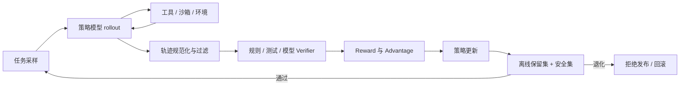

# Agentic RL 面试指南

> Agentic RL 的增量不只是“把 GRPO 用到 Agent 上”，而是把长轨迹、环境交互、稀疏反馈、信用分配和训练基础设施同时纳入设计。

---

## 📌 本节目标

- 能把一个 Agent 任务明确写成 MDP / POMDP。
- 区分 SFT、单轮 RLVR、多轮对话 RL 与 Agentic RL。
- 讲清轨迹生成、奖励、优势估计、loss mask 和策略更新。
- 能诊断零奖励、熵坍塌、reward hacking、长尾轨迹和训推不一致。

## 💡 核心概念

对一个工具型 Agent，可以用 POMDP 描述：

```text
隐藏状态 s_t：环境真实状态、任务进度、外部副作用
观测 o_t：用户输入、工具返回、被压缩的历史
动作 a_t：文本、结构化工具调用、终止或请求人工介入
奖励 r_t：结果正确性、过程质量、成本、安全和业务价值
策略 π(a_t | h_t)：根据可见历史 h_t 选择下一动作
```

Agentic RL 的难点来自五件事同时发生：轨迹长、反馈延迟、环境可能随机、动作会改变外部状态、训练数据由当前策略自己产生。

### 与相邻训练范式的边界

| 范式 | 数据来自哪里 | 主要优化对象 | 典型限制 |
|:---|:---|:---|:---|
| SFT | 教师或人工轨迹 | 模仿目标动作 | 学不到教师轨迹外的恢复策略，易受分布偏移影响 |
| 偏好优化 | 成对偏好 | 输出排序倾向 | 环境交互与长程信用通常较弱 |
| 单轮 RLVR | 单次生成 + 可验证结果 | 最终答案策略 | 环境状态变化和多步决策有限 |
| Agentic RL | 当前策略与环境交互轨迹 | 多步工具使用与决策 | 环境、verifier 和 rollout 成本高 |

## 🔍 深入理解

### 1. 三种建模粒度

| 粒度 | Action | 优点 | 风险 |
|:---|:---|:---|:---|
| Token-level | 单个 token | 与语言模型概率天然对齐 | 信用跨度太长、计算贵 |
| Turn-level | 一次模型回复或工具调用 | 对应真实决策边界 | 动作空间巨大、整段概率尺度不稳 |
| Trajectory-level | 完整轨迹 | 结果判定简单 | 把同一奖励广播给所有步骤，信号稀释 |

实践中常见“token 参数化 + trajectory 奖励”的错配。面试时不能只指出问题，还要给缓解手段：过程奖励、turn-level advantage、分支 rollout、反事实对照、失败前缀标注和更好的 critic。

### 2. 训练闭环



工具观测通常参与上下文 prefill，但不应被当成模型生成 token 计算策略 loss。还要正确处理 padding、system prompt、历史动作、工具返回和截断轨迹的 mask。

### 3. Reward 与 Verifier

奖励可以拆成：

```text
R = w_result * R_result
  + w_process * R_process
  - w_cost * Cost
  - w_risk * Risk
```

但权重越多不代表越好。格式奖励过强可能让模型只学会输出合法 JSON；步数惩罚过强会诱导早停；测试奖励依赖不完整测试时会被 hack。Verifier 自己也必须有准确率、覆盖率、可攻击性和成本评测。

### 4. Rollout 基础设施

长轨迹训练通常由 rollout 而非反向传播成为瓶颈。需要考虑：

- 同步、异步或服务化 rollout。
- 策略版本与采样轨迹的 staleness。
- 环境快照、确定性、超时和副作用清理。
- 长短轨迹混排造成的尾部延迟。
- Prefix / KV cache 复用与工具等待期间的资源调度。
- 训练与真实推理的 prompt、tool schema、采样参数和 Harness 一致性。

## 🎯 面试中如何考

### 高频必答

1. **Agentic RL 与普通单轮 RLVR 的核心差别是什么？**
   - 回答轴：多步状态转移、外部观测、延迟奖励、长程信用和环境副作用。

2. **为什么工具型 Agent 更接近 POMDP？**
   - 回答轴：环境隐状态、信息不完整、上下文压缩、异步副作用。

3. **为什么把最终奖励广播给全部 token 有问题？**
   - 回答轴：routine step 增加方差、关键决策信号稀释、长度偏置。

4. **SFT 与 Agentic RL 怎样配合？**
   - 回答轴：SFT 冷启动格式与基本策略，RL 在 on-policy 状态分布上探索和优化结果。

5. **什么任务不应该上 Agentic RL？**
   - 回答轴：无可信环境、无可验证结果、基线接近零、规则方案已经足够、风险不可控。

6. **工具返回是否计算 loss？**
   - 回答轴：作为观测参与条件上下文；策略 loss 只覆盖模型动作 token，并说明具体 mask。

7. **如何防止早停骗奖励？**
   - 回答轴：环境完成判定、结果 verifier、截断语义、失败惩罚和任务进度信号。

8. **GRPO 搬到多轮 Agent 会先遇到什么问题？**
   - 回答轴：组内可比性、环境随机性、长度差异、轨迹级优势广播和信号稀释。

### 深挖追问

9. 同一次 rollout 中三个并行 tool call 算一个 action 还是三个？两种建模如何影响信用分配？
10. 强制 max_steps 截断的轨迹应该记失败、丢弃还是 bootstrap？各自隐含什么语义？
11. 如何用实验区分“信用分配差”和“探索不足”？
12. 异步 rollout 中旧策略轨迹太多会怎样？如何量化和限制 staleness？
13. 过程奖励模型错了，比只有最终奖励更危险吗？
14. Reward hacking 在 Coding Agent 中有哪些具体形式？
15. 如何判断该继续做 Harness，还是开始做 RL？
16. 环境随机性如何破坏 group-relative baseline 的可比性？
17. 轨迹长度差 10 倍时，loss 聚合怎样避免偏向长样本或短样本？
18. 换了一套工具 schema 后，训练所得策略为什么可能失效？

### 系统设计题

> 为仓库级 Coding Agent 设计一条 Agentic RL 训练流水线。

至少覆盖：

- 从 issue 与 commit 构造任务，避免时间泄漏和仓库污染。
- 用容器或虚拟机固定依赖、网络、权限和初始 git 状态。
- 动作空间：搜索、读文件、编辑、运行测试、结束任务。
- 结果 verifier、过程信号、成本项和安全项。
- 并行 rollout、超时、长尾任务与环境重置。
- 训练 / 验证 / 测试仓库切分，以及隐藏测试防 hacking。
- 线上真实任务与离线 benchmark 的差异监控。

## 💻 白板 / 伪代码题

```python
def rollout(task, policy, environment, max_steps):
    observation = environment.reset(task)
    trajectory = []

    for step in range(max_steps):
        action, action_logprobs = policy.act(observation)
        next_observation, env_info = environment.step(action)
        trajectory.append({
            "observation": observation,
            "action": action,
            "action_logprobs": action_logprobs,
            "env_info": env_info,
        })

        if env_info["done"]:
            break
        observation = next_observation

    verdict = verify(task, environment.snapshot(), trajectory)
    return add_masks_rewards_and_version(trajectory, verdict, policy.version)
```

面试时主动补上：异常动作、工具超时、不可逆副作用、强制截断、环境重置失败、策略版本和哪些 token 参与 loss。

## ✅ 项目证据与自检

- [ ] 我能写出自己任务的 state、observation、action、transition、reward 和 terminal。
- [ ] 我有不依赖单一 LLM judge 的结果验证器。
- [ ] 我能展示成功率之外的步数、成本、安全和最差切片指标。
- [ ] 我检查过 reward hacking，并能展示一个真实反例。
- [ ] 我区分了自然终止、失败终止、超时和强制截断。
- [ ] 我能解释 rollout 吞吐为什么是瓶颈，以及如何优化。
- [ ] 我有 SFT baseline、无 RL baseline 和至少一个奖励消融。

## 📚 扩展阅读

- [Agent 强化学习完整指南](../../02-tech-stack/21-agent-reinforcement-learning.md)
- [Post-training 完整指南](../../02-tech-stack/25-post-training-complete-guide.md)
- [Agent Evaluation Harness](../../02-tech-stack/26-agent-evaluation-harness-guide.md)
- [数据合成备战手册](../18-agent-interview-playbooks/data-synthesis-playbook.md)
- [2026 AI 研究方向：Agentic RL](../../06-research-frontiers/01-ai-research-directions-expanded.md#方向三agentic-rl--可扩展奖励验证器)
