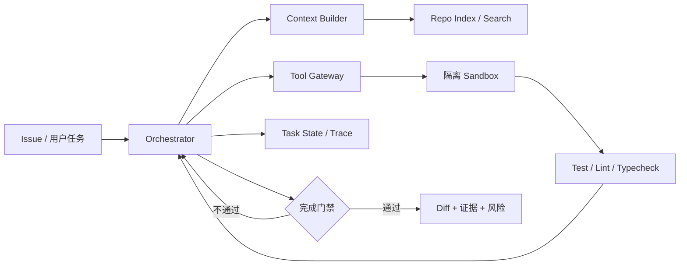

# Coding Agent 面试指南

> Coding Agent 的难点不是“会生成代码”，而是在陌生仓库中可靠完成定位、修改、验证和交付，并让每一步都可恢复、可审计。

---

## 📌 本节目标

- 区分代码补全、代码问答、单文件编辑与仓库级任务。
- 能画出 Coding Agent 的上下文、工具、环境和验证闭环。
- 解释为什么测试通过不等于任务正确，patch 很大也不等于能力强。
- 能讨论 benchmark、Agentic RL、安全、成本和线上反馈。

## 💡 核心概念

### 任务谱系

```text
代码补全
  → 代码解释 / 仓库问答
  → 单点修复 / 测试生成 / Review
  → 跨文件仓库级 Issue
  → 终端 / DevOps / 环境操作
  → 多仓库、长周期软件工程任务
```

任务越向右，越依赖环境、状态管理、工具设计、权限控制和长程恢复；模型单轮代码能力所占比例反而下降。

### 最小执行循环

```text
理解任务 → 建立仓库地图 → 定位候选代码 → 制定修改计划
        → 小步编辑 → 静态检查 / 测试 → 失败归因
        → 继续修改或回滚 → 汇总证据与交付
```

工具至少包含：目录 / 符号搜索、精确读文件、patch 编辑、命令执行、测试、diff / git 状态和任务结束。工具输出需要分页、截断和错误类型，不能把几十万行日志原样塞回上下文。

## 🔍 深入理解

### 1. 上下文工程

仓库级任务的上下文不应等于“把整个仓库塞给模型”。常见分层：

- 固定层：任务、系统约束、工具 schema、仓库规则。
- 地图层：目录、模块职责、依赖与关键符号。
- 工作集：当前假设所需的文件片段、调用链和测试。
- 状态层：计划、已完成步骤、失败尝试和未决问题。
- 证据层：命令结果、diff、测试与静态检查摘要。

压缩时要保留决策、失败原因、文件位置和未完成约束；只做自然语言摘要容易丢掉精确符号与错误信息。

### 2. 编辑与验证

| 环节 | 关键设计 | 常见失败 |
|:---|:---|:---|
| 定位 | 搜索、符号图、测试关联、调用链 | 找到相似代码却不是执行路径 |
| 计划 | 明确变更面、风险、验证方式 | 先写代码再猜需求 |
| 编辑 | 最小 patch、保持风格、避免无关改动 | 重写过多、覆盖用户修改 |
| 验证 | 相关测试 → 扩展测试 → 静态检查 | 只跑一条 happy path |
| 交付 | diff 审查、结果与残余风险 | 声称完成却没有证据 |

测试不是完美 verifier：隐藏需求可能未覆盖，测试也可能本身错误。应组合静态分析、类型检查、现有测试、新增回归测试、差异审查和任务特定不变量。

### 3. 环境与安全

- 每个任务使用可重置的容器或隔离工作区。
- 网络、密钥、文件写入和命令按风险分级。
- 对删除、发布、付费、外部消息等不可逆动作请求确认。
- 命令必须有超时、输出上限和资源配额。
- 记录基础 commit、依赖、环境变量白名单和模型 / Harness 版本。

### 4. 评测

除了 pass rate，还要看：

- 定位准确率与首次有效编辑前的成本。
- 测试通过率、隐藏测试通过率和回归率。
- Patch 大小、无关文件修改率和代码可维护性。
- 平均 / P95 步数、token、墙钟时间和工具失败率。
- 安全违规、用户纠正次数和人工接管率。

公开 benchmark 可用于可比性，但真实线上任务更混乱：需求含糊、环境漂移、权限受限、反馈延迟、仓库存在未提交改动。面试时应主动说明这种外部有效性差距。

## 🎯 面试中如何考

### 高频必答

1. **Coding Agent 与代码补全的本质区别是什么？**
   - 回答轴：多步环境交互、仓库状态、工具执行、验证与副作用。

2. **如何让 Agent 快速理解陌生仓库？**
   - 回答轴：仓库规则、目录地图、符号 / 调用图、测试映射和按需读取。

3. **为什么不能一次性把整个仓库放进上下文？**
   - 回答轴：成本、注意力稀释、更新失真、精确检索和状态管理。

4. **怎样设计代码编辑工具？**
   - 回答轴：结构化 patch、上下文校验、冲突检测、最小变更和可逆性。

5. **测试全过就能结束吗？**
   - 回答轴：测试覆盖、隐藏约束、过拟合测试、静态检查与 diff 审计。

6. **怎样处理长命令输出？**
   - 回答轴：超时、分页、截断、错误摘要、artifact 保存和按需读取。

7. **Coding Agent 最容易出现哪些 reward hacking？**
   - 回答轴：改测试、绕过断言、硬编码答案、删除失败路径、伪造完成。

8. **如何避免 Agent 覆盖用户未提交改动？**
   - 回答轴：初始状态检查、diff 隔离、工作树所有权、冲突检测和最小 patch。

### 深挖与设计题

9. 设计一个支持百万行 monorepo 的上下文检索与缓存系统。
10. Agent 连续三次尝试都失败，应该重试、换策略、回滚还是求助？
11. 怎样判断“定位错了”还是“实现错了”？
12. 多 Agent coding 中 planner、implementer、reviewer 怎样共享状态又避免上下文污染？
13. 如何从 GitHub issue 和 commit 构建无泄漏训练任务？
14. 隐藏测试不完整时，怎样设计更稳健的 verifier？
15. 前端视觉任务无法只用单元测试验证，怎样构建闭环？
16. 如何将真实用户接受 / 拒绝 patch 的信号用于持续改进？
17. 如何比较强模型 + 简单 Harness 与弱模型 + 强 Harness？
18. 怎样让任务跨会话恢复，同时不把过期假设带回来？

## 💻 系统设计模板



面试时补充四条异常流：工具超时、测试本身失败、上下文超限、用户工作区有冲突。

## ✅ 项目证据与自检

- [ ] 我能给出 20～50 个真实任务，而不是只演示一个 happy path。
- [ ] 环境能从固定 commit 自动创建并可靠重置。
- [ ] Agent 的每次读、写、命令和测试都有 trace。
- [ ] 我报告任务成功、回归、安全、成本和尾延迟。
- [ ] 我保留失败 patch，并做过错误分类。
- [ ] 我能展示最小 patch 与“大改一遍”之间的对照。
- [ ] 我明确哪些动作自动执行，哪些必须确认。

## 📚 扩展阅读

- [Claude Code 源码分析手册](../18-agent-interview-playbooks/claude-code-source-playbook.md)
- [Agent Harness 手册](../18-agent-interview-playbooks/agent-harness-playbook.md)
- [Agent Harness Engineering](../../02-tech-stack/27-agent-harness-engineering.md)
