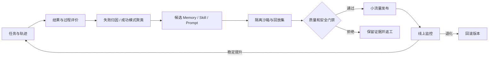

# 自进化 Agent 面试指南

> 面试重点不是“Agent 会反思”，而是系统是否形成了可测量、可验证、可回滚的能力更新闭环。

---

## 📌 本节目标

- 区分反思、记忆、个性化、在线学习与真正的自进化。
- 讲清“经验从哪里来、改什么、谁来评、怎样上线”。
- 能设计一个不会把错误经验无限放大的最小闭环。
- 把自进化连接到 Memory、Skills、Harness、数据和 Agentic RL。

## 💡 核心概念

可以把一个 Agent 系统写成：

```text
Agent = Model + Prompt + Context + Memory + Skills + Tools + Harness
```

如果系统只是保留历史记录，它有记忆，但不一定有进化。一个可检验的自进化闭环至少包含六步：

```text
采集轨迹 → 归因与评价 → 提炼候选更新 → 隔离验证
        → 版本化发布 → 监控、回滚与继续学习
```

判断它是否“真进化”，至少问四件事：

1. **变化是否跨任务持久化**，还是只在当前上下文临时生效？
2. **变化是否影响未来策略**，还是仅仅保存了一段聊天记录？
3. **是否在保留集上稳定提升**，而不是对单个案例过拟合？
4. **是否有版本、准入和回滚机制**，能阻断错误经验扩散？

### 相邻概念的边界

| 概念 | 发生了什么 | 是否自动构成自进化 |
|:---|:---|:---:|
| Self-reflection | 对当前轨迹做批评并重试 | 否，可能不跨任务保留 |
| Memory | 将信息写入并在以后检索 | 否，除非写入策略和使用策略被验证为提升能力 |
| Personalization | 适配用户偏好 | 否，目标可能只是体验一致性 |
| Prompt optimization | 自动搜索或改写提示词 | 部分，是一种受限的系统更新 |
| Skill learning | 将成功经验抽象为可复用过程 | 是常见的非参数进化路径 |
| Continual learning | 持续更新模型或表示 | 可能是，但还需防遗忘和退化 |
| Agentic RL | 用环境反馈优化多步策略 | 可以成为参数化进化引擎 |

## 🔍 深入理解

### 1. 系统究竟能改什么

| 进化对象 | 优点 | 主要风险 | 推荐验证 |
|:---|:---|:---|:---|
| Prompt / Policy text | 便宜、可读、易回滚 | 脆弱、上下文依赖 | 固定任务集 A/B |
| Memory | 个性化快、无需训练 | 污染、冲突、隐私泄漏 | 召回正确率 + 任务成功率 |
| Skill / Workflow | 可复用、可审计 | 技能爆炸、错误路由 | 触发准确率 + 完成率 |
| Tool schema / routing | 能直接改善执行 | 权限扩大、误调用 | 沙箱回放 + 风险分级 |
| Harness / control flow | 可改善长程稳定性 | 系统耦合、回归面大 | Trace replay + 回归集 |
| Model weights | 能内化通用策略 | 成本高、灾难性遗忘 | 保留集 + 能力/安全双评测 |

### 2. 快环与慢环

- **快环**在会话内工作：反思、重试、短期记忆、动态计划。它追求当前任务成功。
- **慢环**跨会话工作：经验聚类、技能提炼、数据审核、训练或版本发布。它追求长期能力提升。

把两者混在一起会产生危险：一次偶然成功可能立刻写成全局规则，一次恶意输入也可能污染后续用户。成熟系统通常让快环提出候选，让慢环基于多条证据审核后再发布。

### 3. 最小安全架构



关键元数据至少包括：来源、创建时间、适用任务、依赖工具、评估分数、版本谱系、权限等级、过期条件和回滚目标。

### 4. 评测不能只看平均成功率

建议同时观察：

- 新任务成功率与相对提升。
- 旧能力保留率，检查灾难性遗忘。
- 更新采用率、误触发率和冲突率。
- 单次成功所需步数、token、延迟和成本。
- 高风险动作率、不可逆错误率和人工接管率。
- 不同任务切片上的最差组表现，而不只看均值。

## 🎯 面试中如何考

### 高频必答

1. **什么才算 Agent 自进化？**
   - 回答轴：跨任务持久更新、影响未来策略、可测量提升、版本与回滚。

2. **Self-reflection 和 self-evolution 有什么区别？**
   - 回答轴：会话内重试 vs 跨任务能力更新；临时上下文 vs 持久状态。

3. **为什么“把所有成功轨迹写入 Memory”会失败？**
   - 回答轴：偶然相关、上下文缺失、冲突、污染、检索噪声、分布漂移。

4. **Prompt、Skill、Memory 和权重更新如何选？**
   - 回答轴：更新频率、可解释性、成本、泛化范围、风险和回滚难度。

5. **怎样证明系统真的越用越好？**
   - 回答轴：时间切分、固定保留集、shadow / replay、版本对照、显著性和成本。

6. **自进化闭环里最危险的正反馈是什么？**
   - 回答轴：错误评价器认可错误策略，错误策略继续生成训练数据并强化自己。

### 深挖追问

7. 如何给经验建立 lineage，定位某次退化由哪条更新引起？
8. 多个 Skill 同时匹配时怎样路由，如何处理依赖和冲突？
9. 什么情况下应该删除或降权记忆，而不是继续追加？
10. 用户反馈很稀疏且有偏时，如何构建可信评价信号？
11. 如何防止 prompt injection 被系统提炼成长期经验？
12. 线上任务分布持续变化时，保留集应当怎样更新？
13. 能否让 Agent 修改自己的 Harness？权限边界在哪里？
14. 多 Agent 系统中，经验属于个体、角色还是整个团队？
15. 怎样区分模型能力提升与脚手架变化带来的提升？

### 系统设计题

> 设计一个“会从失败工单中学习”的客服 Agent。

答题时至少画出：

- 轨迹、人工反馈与业务结果的采集链路。
- PII 脱敏、注入检测和数据准入。
- 失败归因与候选 Skill 生成。
- 离线回放集、对抗集与旧能力保留集。
- 灰度发布、版本追踪、线上监控和自动回滚。
- 哪些动作必须人工审批，哪些内容永远不能进入长期记忆。

## 🧪 项目证据怎么准备

不要只做“反思后重试”的演示。一个最小可展示项目应当包含：

1. 50～200 个可重复任务和明确结果判定。
2. 一个固定 baseline，以及至少一种更新对象。
3. 候选更新的来源与版本记录。
4. 更新前后在新任务、旧任务和安全集上的对比。
5. 至少一次被门禁拒绝的坏更新，以及原因。
6. 一键回滚和对单条经验的影响追踪。

### 面试前自检

- [ ] 我能给“自进化”一个可证伪的定义。
- [ ] 我知道系统状态中哪些可变、哪些必须锁定。
- [ ] 我能解释评价器错了时系统会怎样失控。
- [ ] 我准备了旧能力保留、隐私和安全指标。
- [ ] 我有一个负结果或回滚案例。

## 📚 扩展阅读

- [Hermes Agent 自进化备战手册](../18-agent-interview-playbooks/hermes-self-evolution-playbook.md)
- [Agent Skills / 程序性记忆手册](../18-agent-interview-playbooks/agent-skills-procedural-memory-playbook.md)
- [Agent Memory 手册](../18-agent-interview-playbooks/agent-memory-playbook.md)
- [数据合成手册](../18-agent-interview-playbooks/data-synthesis-playbook.md)
- [2026 AI 研究方向：自进化](../../06-research-frontiers/01-ai-research-directions-expanded.md#方向二自进化--fully-self-training)
