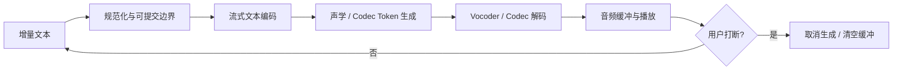

# 语音生成面试指南

> 语音生成系统要同时处理“说什么、怎么说、像谁说、何时说完”，并在音质、相似度、韵律、实时性和安全之间做取舍。

---

## 📌 本节目标

- 建立从文本规范化到声学生成、vocoder 和流式播放的完整链路。
- 区分自回归、非自回归、扩散 / 流模型和音频语言模型路线。
- 能设计多说话人、跨语言、情感、长文本和流式 TTS。
- 能讨论数据、评测、延迟、音色克隆与滥用防护。

## 💡 核心概念

### 系统分层

```text
文本 → 规范化 / 分词 / 音素 / 韵律提示
    → 文本与说话人 / 风格表示
    → 时长、基频、能量或离散音频 token
    → 声学生成
    → Vocoder / Codec 解码
    → 后处理、水印与安全检测
```

端到端系统可能把多个模块合并，但问题仍然存在：发音、时长、韵律、音色、声学细节和波形生成，只是由同一个模型隐式解决。

### 表示选择

| 表示 | 优点 | 挑战 |
|:---|:---|:---|
| Mel 频谱 | 稳定、可解释、生态成熟 | 依赖 vocoder，部分细节丢失 |
| Waveform | 直接优化最终信号 | 序列极长、训练 / 生成成本高 |
| Neural codec token | 序列化、可与语言模型结合 | codec 上限、码本利用和量化伪影 |
| Continuous latent | 适合扩散 / 流生成 | 对齐、解码和稳定性设计复杂 |

## 🔍 深入理解

### 1. 路线选择

| 路线 | 特点 | 典型取舍 |
|:---|:---|:---|
| Autoregressive | 顺序生成，条件依赖强 | 自然但慢，易出现停不下来或漏读 |
| Non-autoregressive | 并行生成，常显式预测时长 | 快，但对齐与韵律可能更难 |
| Diffusion / Flow | 逐步或连续生成声学表示 | 质量高，采样成本与流式设计复杂 |
| Audio language model | 生成 codec token，可统一语音任务 | 序列长、延迟与 codec 质量受限 |

选型要看场景：有声书关注长文本稳定与韵律；客服关注首包、可打断和数字读法；配音关注音色、情感和可控编辑；端侧则更关注模型尺寸与能耗。

### 2. 对齐与韵律

- 文本归一化决定数字、日期、符号和缩写如何读。
- Grapheme-to-phoneme 处理多音字、外来词和代码混读。
- Duration / alignment 决定漏字、重复和节奏。
- F0、energy、style / emotion 控制韵律与表达。
- 长文本需要跨句状态、段落节奏与说话人稳定性。

### 3. 流式 TTS

关键指标不只是总 RTF：

- 首包音频延迟。
- 稳态 chunk 间隔与抖动。
- 可打断后停止延迟。
- 前后 chunk 边界连续性。
- 文本尚未完整到达时的 lookahead 与发音正确性。

流式系统常在更小 lookahead 与更自然韵律之间权衡。过早生成可能在数字、专名或句末语气上犯错。

### 4. 评测与安全

| 维度 | 常见方法 | 风险 |
|:---|:---|:---|
| 可懂度 | ASR WER / CER、人听转写 | ASR 偏差不等于人类可懂度 |
| 自然度 | MOS / CMOS、盲测 | 成本高、标注方差大 |
| 音色相似 | speaker embedding + 人评 | 指标可能忽略感知细节 |
| 韵律 / 情感 | F0、时长、风格分类 + 人评 | 标签主观、跨文化差异 |
| 稳定性 | 漏字、重复、异常停顿、爆音 | 必须覆盖长文本与难例 |
| 性能 | 首包、RTF、P95、内存 | 硬件、并发、文本长度要固定 |
| 安全 | 授权、活体 / 反欺诈、水印、可追踪 | 音色克隆的身份与诈骗风险 |

## 🎯 面试中如何考

### 高频必答

1. **现代 TTS 的完整链路有哪些模块？**
   - 回答轴：文本前端、对齐 / 时长、声学表示、生成模型、vocoder / codec、安全。

2. **为什么需要文本规范化和音素？**
   - 回答轴：数字、缩写、多音字、跨语言和发音泛化。

3. **自回归与非自回归 TTS 如何选？**
   - 回答轴：自然度、延迟、对齐稳定、并行性和目标场景。

4. **Mel + vocoder 与 codec token 路线的差别？**
   - 回答轴：表示、序列长度、生成范式、解码质量和统一建模。

5. **零样本音色克隆依赖什么？**
   - 回答轴：说话人表示、内容 / 音色解耦、参考质量、跨语言和安全授权。

6. **TTS 为什么会漏字、重复或停不下来？**
   - 回答轴：对齐、时长、终止预测、训练数据和长文本分布。

7. **如何降低首包延迟？**
   - 回答轴：流式文本前端、增量编码、小 lookahead、缓存、并行解码和轻量 vocoder。

8. **怎样评估 TTS？**
   - 回答轴：可懂度、自然度、相似度、韵律、稳定性、性能和安全。

### 深挖与设计题

9. ASR WER 下降但 MOS 也下降，可能发生了什么？
10. 如何处理中文、英文、数字和代码混读？
11. 参考音频带噪或情感很强时，怎样避免污染目标音色？
12. 长篇有声书中如何保持人物音色和段落韵律一致？
13. 流式生成的 chunk 边界出现爆音，如何定位？
14. 怎样让用户可控语速、停顿、重音和情绪，而不破坏内容？
15. 小语种数据很少时，怎样利用多语种迁移与合成数据？
16. Codec 的重建指标很好，但生成语音仍有金属感，为什么？
17. 如何检测并阻止未授权音色克隆？
18. 设计一个支持实时可打断对话的语音 Agent 输出系统。

## 💻 流式系统设计提示



面试时主动说明：文本回滚、网络抖动、过短 chunk、专名词典、句末语气、跨 chunk 音色状态和打断后的资源清理。

## ✅ 项目证据与自检

- [ ] 我能画出文本到波形的完整链路。
- [ ] 我知道系统的表示、对齐和终止分别怎样实现。
- [ ] 我报告短句、长文、数字、专名、跨语言等切片。
- [ ] 我同时测可懂度、自然度、相似度、稳定性和延迟。
- [ ] 流式项目报告首包与 P95，不只报告平均 RTF。
- [ ] 音色克隆有授权、审计、水印或其他滥用防护。

## 📚 扩展阅读

- [LLM / VLM / RLHF 理论题](../01-theory-questions.md)
- [模型评估题库](../13-model-evaluation.md)
- [数据与评测面试指南](./data-and-evaluation.md)
- [多模态资源导航](../../../resources/multimodal/README.md)
