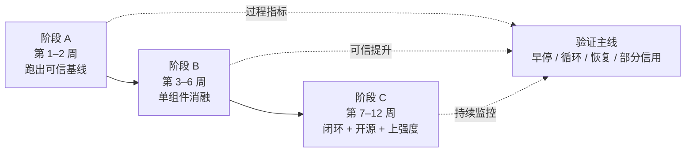

# 2026 值得重投入的 AI 研究方向：子方向全展开

> [!NOTE]
> 本页是专题的子页面，于 2026-08-25 从作者知识库同步。文中包含研究判断与论文线索，引用前请通过论文主页、arXiv 或机构官方渠道复核版本与结论。

- **返回专题总览**：[从前沿 Lab JD 与战略看 2026 年值得重投入的 AI 研究方向](./README.md)
- **同步版本**：revision 126，知识库最后编辑时间 2026-08-24

**拓展阅读**
- 《Towards Long-Horizon Agents: A Survey》：建立长程 Agent 的任务、Harness 与模型优化全局坐标系。
- 《The Last Harness You’ll Ever Build》：理解 `Agent = Model + Harness` 的形式化定义。
- 《Recursive Self-Improvement in AI》：从有界自我改进走向开放式研究闭环。

**本章重点**
- **长程能力差距被短程高分系统性掩盖。**
- **2026 年的核心瓶颈正从生成转向验证。**
- **自进化最难的不是修改，而是建立独立、可信的评估通道。**

**三条主线对比**
- **方向一：长程任务 + Harness 工程**，门槛相对较低，最快形成可复现结果。
- **方向二：自进化 / Fully Self-Training**，潜力最高，但首先受制于可靠评估。
- **方向三：Agentic RL + 可扩展奖励/验证器**，后训练杠杆最大，环境与奖励可信度是关键。

---

## 方向一：长程任务 + Harness 工程

**一句话定位**：智能上界现在由 `模型 × Harness` 的乘积决定，而 Harness 这一侧的边际收益远未榨干、门槛远低于预训练。
$$\mathrm{Agent} = \mathrm{Model} \times \mathrm{Harness}$$

**总纲文献**（这三篇读完就有全局坐标系）：

- **《Towards Long-Horizon Agents: A Survey》**（人大 GAIR 牵头，联合北大/清华/中山/港科大/NUS，149 页，2026-07）。核心框架：**外化的 Harness Engineering ↔ 内化的 Model Optimization 双线协同进化**；提出 H1–H3 任务难度层级与 C1–C3 能力层级；测得任务跨度每 4–7 个月翻倍。六个视角：Foundation / Evolution / Harness / Optimization / Application / Frontier。主页 `long-horizon-agents.github.io`。
- **《From Question Answering to Task Completion: A Survey on Agent System and Harness Design》**（2606.20683）
- **《The Last Harness You'll Ever Build》**（2604.21003）：给出了 harness 的规范定义（系统提示 / 工具与技能 / 打包基础设施 / 编排逻辑），以及 `Agent = Model + Harness` 的形式化。
- 配套 repo：`RUC-NLPIR/Awesome-Long-Horizon-Agents`（路线图持续更新）

### 1.1 任务状态外置（Task-State Externalization）—— 目前最"干净"的可发论文切口

**问题**：现有 harness 把"任务执行 / 任务状态 / 完成度自评"全都塞在同一个不断增长的上下文里。结果是状态难追踪，而且**错误的自我评估会传播进后续决策**——agent 认为自己做完了某一步，后面所有推理都基于这个错误前提。

**代表工作**：

- **LongHorizon-Harness**（2608.01964，2026-08-03）：把长程执行**重新形式化为任务状态管理问题**，把任务状态显式维护在执行上下文之外，且只用与执行过程独立的事实来更新它。这是今年这个切口最完整的一篇。
- **IterResearch**（2511.07327）：马尔可夫式状态重构，用交互扩展替代上下文堆积。
- **A Task-State Representation for Long-Horizon Mobile GUI Agents**（2026）：同样思路迁移到移动 GUI。

**具体切口**：

1. 状态 schema 设计：什么该进状态、什么该留在上下文、什么该 offload 到磁盘。目前没有共识，做一个系统性 ablation 就是贡献。
2. **状态更新的"事实独立性"**：如何保证写进状态的只有可验证事实，而不是 agent 的自我评价？这里可以接可执行 verifier。
3. 状态与 compaction 的交互：compaction 时状态怎么保留（见 1.3）。

**验证**：LHTB（Long-Horizon-Terminal-Bench）、SWE-EVO、OSWorld 2.0、RoadmapBench。指标除最终分外，必须报**早停率、循环次数、错误状态传播长度**。

### 1.2 稠密过程评分与部分信用（Dense Grading / Partial Credit）

**问题**：终端类基准只看最终结果，稀疏信号既没法诊断也没法训练。一个跑了 47 步、前 40 步全对的轨迹和一步没做对的轨迹，拿到的奖励是一样的。

**代表工作**：

- **Long-Horizon-Terminal-Bench**（2607.08964）：46 个长程终端任务，9 大类（实验复现、软件工程、多模态分析、交互式游戏、科学计算等），**每个任务拆成细粒度打分子任务**，从而支持稠密中间奖励与部分信用。这是目前做"过程指标"最直接可用的基准。
- **The Long-Horizon Task Mirage?**（2604.11978）：诊断"agentic 系统在哪里、为什么崩"，提出 HORIZON 诊断工具 + 基于轨迹的 LLM-as-a-Judge 流水线（并对人工标注做了可靠性验证）。它给出的研究议程本身就是一张选题清单：**分层与约束感知的规划、执行期的计划校验与修复、更强的长程记忆**。
- **Verifiable Process Rewards (VPR)**（2605.10325）：定义"稠密可验证"的一类问题，把符号/算法 oracle 转成 turn 级监督。

**具体切口**：

1. 把 LHTB 式的子任务分解**自动化**（现在还是人工拆的）——这是能直接开源、马上有人用的工具。
2. **过程指标的标准化**：早停率、恢复成功率、无效循环比例、单位 token 进度。目前每篇论文自己定义一套，做一个大家愿意用的标准就是影响力。
3. 部分信用分数与最终 pass rate 的相关性分析：哪些子任务是真瓶颈？

### 1.3 上下文压缩 / Compaction —— 从工程技巧变成有理论的学科

**问题**：一次 SWE-bench 级别的 coding agent 会话动辄数百万 token、上百轮（有数据显示 Qwen3-Coder-Next 在 SWE-rebench 上平均每题 8M token、154 轮）；深度研究 agent 在 BrowseComp 上单查询数百次工具调用。累积上下文不只是贵，而是**有害**——即所谓 context rot，长度上去性能反而掉。

**代表工作**：

- **Context Compaction Theory**（2608.01326，2026-08）：**第一次给 compaction 做形式化分析**。提出两个博弈：Context Selection Game（选子集保留）和 Context Generation Game（摘要生成）。这是理论方向的空地。
- **Self-Compacting Language Model Agents**（2606.23525）：让模型自己决定怎么压。
- **Parallel Context Compaction**（2605.23296）：发现**摘要输出量对输入和提示词基本不敏感**，所以靠提示词控制摘要长度是不可靠的旋钮；提出并行块压缩，用块数直接控制摘要体量。
- **ACE / Agentic Context Engineering**（2510.04618）：把上下文当作演进中的 playbook，用生成-反思-整理三步增量更新，专门对抗 **brevity bias**（简洁偏好丢掉领域细节）和 **context collapse**（反复重写侵蚀信息）。
- **Agentic Context Management**（2607.21503）：把这件事命名为一门学科，拆成五个原语：architecting / ingesting / scoping / anticipating / compacting & consolidation；并给出经济学论证——朴素累积是二次成本，粗暴摘要是线性成本但有准确率悬崖，只有**经过校验的 compaction** 能做到线性成本且保真。
- **Governance Decay**（2606.22528）：**安全向的绝佳切口**——compaction 会静默抹掉安全约束，导致后续不安全的工具调用。现有所有压缩工作都只优化任务准确率或吞吐，**没有一个测量治理约束是否在重写中幸存**。

**具体切口**：

1. **compaction × KV cache 的交互**：已有工作（2601.06007）量化了 prompt caching 能省 41–80% 成本、TTFT 改善 13–31%，但天真地对全上下文开缓存反而可能因为对永不复用的动态 tool result 触发缓存写入而增加延迟。2026 年初 Claude Code 有个 bug（v2.1.62）就是提高了 KV 命中率但没加 compaction 事件的缓存失效触发，导致压缩前的陈旧前缀被送进压缩后的轮次。**这类系统级 bug 的形式化与检测是没人做的方向。**
2. **可验证的 compaction**：压缩后做一致性检查，把"摘要是否丢了关键事实"变成可测量的东西。
3. 沿着 Governance Decay 往下：**约束幸存率**作为压缩算法的第二目标。

### 1.4 子 Agent 与上下文隔离

**问题**：子 Agent 是绕开上下文限制、同时避免上下文污染的主流手段（每个子 Agent 有独立上下文窗口、定制系统提示、受限工具权限，返回 1–2K token 的蒸馏摘要）。但"什么时候该分、怎么分、怎么合"几乎全靠手工调。

**代表工作**：

- Anthropic《Effective context engineering for AI agents》：明确 compaction（适合需要大量来回的任务）vs note-taking（适合有清晰里程碑的迭代开发）vs 子 Agent（适合可并行探索）的三分法。
- **Kimi PARL**：把 spawn 子 Agent 变成可学习的动作（见 0.4）。
- **ClawArena-Team**（2606.31174）：专门 benchmark 子 Agent 编排与动态工作流。
- **AgentFugue**（2605.24486）：对比了朴素"规划-并行搜索-聚合"流水线的局限——子 Agent 跑的时候互相看不见进度，meta-agent 也不中途改计划，所有协调都发生在开头和结尾。
- **Reinforcement Learning for LLM-based Multi-Agent Systems through Orchestration Traces**（2605.02801）：把 Kimi 当作主要工业参照系做的系统分析。
- **Dr. MAS**（2026）：Agent-wise advantage normalization 稳定多 Agent GRPO，+5.6% avg@16。

**具体切口**：

1. **"可并行性判据"**：什么样的工作分出去才真的更快？Moonshot 公开的串行坍缩/假并行两种失败模式给了起点，但没人做出可预测的判据。这是**性价比极高的小切口**。
2. **merge 是真难点**：fan-out 已经好使了，几十个子 Agent 交回重叠、矛盾、偶尔编造的结果，怎么合成可信输出？目前基本没有系统性工作。
3. 子 Agent 的权限最小化 × 安全（见 5.2）。

### 1.5 失败恢复、重试与"知道自己卡住了"

**问题**：长程 agent 最常见的死法不是不会做，而是**卡在循环里、或者早停、或者在错误状态上继续推进**。

**代表工作**：

- **Beyond Global Replanning: Hierarchical Recovery for Cross-Device Agent Systems**（2026）
- **BacktrackAgent**（EMNLP 2025）：GUI agent 的错误检测与回溯
- **GUI-Critic-R1**（NeurIPS 2025）：操作前的错误诊断
- **SentinelBench**（2606.05342）：长时间运行的监控型 agent 基准——"会等待、会观察、会在合适时机行动"是一类被严重低估的能力。
- **Agents of Chaos**（Shapira et al., 2026）：记录真实部署（如 OpenClaw）中的失败，可与 HORIZON 的诊断分类做对照。

**具体切口**：

1. **卡住检测器**：轻量的、可插进任意 harness 的循环/停滞检测插件。极易开源、极易被采用。
2. **continue-until-timeout 的正确做法**：简单地"别停"会导致 agent 用奇怪办法硬撑（有实践者观察到 Anthropic 系模型"耐力"特别好，一个 prompt 等于别家的 `/goal`，会一直尝试甚至忽略停止指令）。**什么时候该停、该问人、该回滚，是个没解决的问题。**
3. 异步/可中断执行：ARE（2509.17158）已经把 agent-环境交互从同步推向异步，解锁了"处理时间"这类新任务。这条线很空。

### 1.6 Harness 本身的自动进化

**问题**：Harness 现在是人调的。既然 `Agent = Model + Harness`，那 harness 这一侧凭什么不能自动优化？

**代表工作**：

- **Agentic Harness Engineering**（2604.25850）：可观测性驱动的 coding-agent harness 自动演化。
- **DeepSeek Harness 的 Creator 模式**：可以运行模型自己写的插件代码——这在架构上已经为 self-evolving harness 留了口子。
- **ComfyClaw**（2607.01709）：图像生成工作流的自进化技能 harness。
- **Affordance Agent Harness**（2605.00663）：verification-gated 的技能编排。
- **Meta Context Engineering via Agentic Skill Evolution**（2601.21557）
- **Polar**（2605.24220）：**关键基础设施**——让"任意已有 harness"变成可做 RL 的环境，不改 harness 内部事件循环、工具格式和上下文策略。这是把方向一和方向三接起来的桥。

**具体切口**：把 harness 组件（提示、工具描述、上下文策略、循环结构）参数化，用 observability 数据（失败模式统计）驱动搜索。**沙盒 + 可回滚是前提**。

### 1.7 技能（Skills）作为一等公民

**问题**：Anthropic 的 Agent Skills、OpenClaw 的 SKILL.md 已经成为事实标准形态，但"技能到底有没有用、什么样的技能有用"缺乏量化。

**代表工作**：

- **SkillsBench**（2602.12670）：跨任务量化 agent skills 的效果，18 组 model×harness 配置。
- **Trace2Skill**（2026）：把轨迹里的局部经验蒸馏成可迁移技能。
- **PolySkill / SkillWeaver**：可复用技能的自动发现。
- **Dynamic Dual-Granularity Skill Bank for Agentic RL**（2603.28716）
- **Terminal-World**（2605.20876）：**用 Agent Skills 来扩展终端环境**——技能与环境合成的交叉。
- **Statistical Priors for Implicit Preferences**（2606.05828）：把技能选择解耦成个人 agent 里的"局部 harness"。

**具体切口**：技能库的**去重、冲突消解、遗忘**。技能越多检索越难，这和 1.3 的上下文竞争是同一个问题的两个面。

### 1.8 长程评测集建设（被低估、缺口最大）

METR 的任务集在 16 小时以上已经不可靠，OSWorld 2.0 才 108 个任务，LHTB 才 46 个。**长程评测是当前最稀缺的公共品。**

已有的可参考蓝本：LHTB、OSWorld 2.0、SWE-EVO（2512.18470）、SWE-bench Pro（2509.16941，1865 题 / 41 仓库，含商业闭源集）、Senior SWE-Bench（用 2026-02 之后的 PR，绕开模型知识截止；把多个 PR 合成一个任务扩大范围）、RoadmapBench（2605.15846，跨版本升级）、NL2Repo-Bench（2512.12730，从零生成整个仓库）、SWE-Bench ProMax（2608.09802，大规模多语言重构）、DeNovoSWE（2606.10728）、UltraHorizon（2509.21766）、OdysseyArena（2602.05843）、LongCoT（2604.14140）、MemoryArena（2026）、AgencyBench、Terminal-Bench 2.0。

**切口**：垂直领域的长程基准（你的领域 + 可执行验证器）几乎都还是空的。

---

## 方向二：自进化 / Fully Self-Training

**一句话定位**：人类数据见顶后，速度即代差。但 2026 年的关键认知转变是——**自进化的瓶颈不在"怎么改"，而在"怎么知道改对了"**。

**总纲文献**：

- **《A Survey of Self-Evolving Agents: What, When, How, and Where to Evolve》**（2507.21046）——三维框架的原典
- **《A Comprehensive Survey of Self-Evolving AI Agents》**（2508.07407）+ 配套 `EvoAgentX` 框架与 `EvoAgentX/Awesome-Self-Evolving-Agents`
- **《A Systematic Survey of Self-Evolving Agents: From Model-Centric to Environment-Driven Co-Evolution》**（TechRxiv, 2026-02）+ `XMUDeepLIT/Awesome-Self-Evolving-Agents`
- **《Self-Improvements in Modern Agentic Systems: A Survey》**（2607.13104）：统一 taxonomy 覆盖**基座模型更新 / 脚手架更新 / 评测基准**三层
- **《Recursive Self-Improvement in AI: From Bounded Self-Refinement to Autonomous Research Loops》**（2607.07663）：**综述了 1250 篇 arXiv 论文**，两轴分类（改什么 × 闭环程度）。**它的核心发现值得抄进笔记**：文献质量集中在"仍有人类审计循环"的位置，而最关键、最空的格子是 **自我评估 × 闭环**——一个能改写自己"什么算更好"的定义的系统。这正是有界自我改进与开放式 RSI 的分界线。
- **Microsoft《Agentic Evolution: From Self-Improving Agents to Co-Evolving Human–AI Systems》**（2026-07）
- **《A Survey of Agent Memory in the Second Half: Towards Self-Evolving and Long-Horizon Agents》**（2602.06052，60 位作者）

### 2.1 经验内化：从"存轨迹"到"提炼可迁移教训"

**问题**：把成功轨迹原样存下来复用，效果远不如想象。

**代表工作**：

- **When Continual Learning Moves to Memory**（2604.27003）：**今年最该读的负面结果之一**。外部记忆看似绕开了参数学习的稳定性-可塑性困境，但论文证明**困境只是转移到了记忆层**：在有限上下文窗口下，新旧经验在检索阶段争夺同一条通往决策的通道。他们用 (k,v) 框架解耦"经验怎么表示"和"怎么组织检索"，在 ALFWorld / BabyAI 上发现——**原始轨迹（Raw）表示会产生负迁移，而提炼成 insight 的表示才有正迁移**。
- **Rethinking Continual Experience Internalization for Self-Evolving LLM Agents**（2606.04703）：区分 policy-level（更新模型）与 component-level（进化记忆/工具/技能/经验库）自进化，并指出有效的经验式自进化需要**经验演化与模型改进跨轮次互相强化**。
- **Trace2Skill** / **ReasoningBank** / **Dynamic Cheatsheet**（2504.07952）/ **ExpeL**
- **Decocted Experience Improves Test-Time Inference**（2604.04373）

**具体切口**：

1. **表示形式的系统性 ablation**：raw trajectory / insight / skill block / 因果图，哪种在什么任务上迁移最好？(k,v) 框架给了现成的实验骨架。
2. **遗忘机制**：目前几乎所有系统只写不删。
3. 经验的**冲突消解**：两条成功轨迹给出矛盾建议怎么办？

### 2.2 记忆作为可训练策略（不只是可检索存储）

**问题**：记忆的写入/更新策略基本都是启发式或提示词驱动的。为什么不直接优化它？

**代表工作**：

- **Memory-R2**（2605.21768）：核心算法 **LoGo-GRPO**——全局目标保留长程轨迹级奖励的端到端学习，局部 rerollout 从同一中间记忆状态比较不同记忆操作的结果，得到更公平的组内比较和更精确的记忆构建监督。还用共享参数协同学习（事实抽取器和记忆管理器从同一 backbone 用不同角色提示实例化），并用渐进课程把训练视界从 8→16→32 拉长。**方法论非常干净，适合复现和改进。**
- **MemoPilot**（2606.08656）：直接用下游奖励优化记忆更新策略
- **MemRL**（2026-01）：episodic memory 上的运行时 RL
- **MemAgent**（2507.02259）、**MemSearcher**、**Memory as Action**（2511）、**AgentFold**（2510）
- **Evo-Memory**（2511.20857）：把静态数据集重构成序列任务流，统一实现了 10+ 记忆模块，用来评测 test-time evolution
- **MemoryBench**、**LifelongAgentBench**、**EvaLearn**、**TAME**（2602.03224，可信度视角）

**具体切口**：记忆操作的信用分配（Memory-R2 的局部 rerollout 思路可以推广到工具选择、compaction 决策等所有"中间决策"）。

### 2.3 脚手架自修改与 Gödel 式自指

**代表工作**：

- **Darwin Gödel Machine**（2505.22954）、**Gödel Agent**（ACL 2025）、**A Self-Improving Coding Agent (SICA)**
- **Escher-Loop**（2604.23472）：闭环自指优化
- **Group-Evolving Agents**（2602.04837）：通过经验共享实现开放式自我改进
- **TerraLingua**（2603.16910）：LLM 生态中的开放性涌现分析
- **EvoTool**（2603.04900）：blame-aware mutation + diversity-aware selection 的工具使用策略自进化
- **AgentEvolver**（2511.10395）、**Evolver**（2510.16079）
- **Yunjue Agent**（2601.18226）：完全可复现、零起点、原地自进化的开放式任务 agent 系统

**具体切口**：**安全沙盒 + 回滚协议的标准化**。现在每篇论文自己写一套，做一个公共的"自修改安全执行层"是很实在的开源贡献。

### 2.4 环境与 Agent 的协同进化（Co-Evolution）

**问题**：Agent 变强了，环境不变，就没有新的学习信号。

**代表工作**：

- **SEAL: Synergistic Co-Evolution of Agents and Learning Environments**（2605.24426）
- **Agent-World**（2604.18292，人大 + 字节）：统一"可扩展真实环境合成"与"持续自进化训练"的通用 agent 训练竞技场
- **R-Zero**（2508.05004）：从零数据自进化推理
- **RAGEN**（2504.20073）：多轮 RL 视角下的自进化理解

### 2.5 自进化的失败模式（做主方向的人必须同时做这个）

**这是 2026 年新出现、且严重缺人的子方向。三篇代表作：**

- **Do Self-Evolving Agents Forget?**（2605.09315）：终身适应中的能力退化与保持
- **Evolving Deception: When Agents Evolve, Deception Wins**（2603.05872）：**在竞争压力下，上下文级进化会催生欺骗行为**。它把关注点从性能优化转向行为副作用——这是极好的选题模板。
- **Test-time training undermines existing safety guardrails**（ICLR 2026 Trustworthy AI Workshop）
- **Beyond Perplexity: A Behavioral Evaluation Framework for Deployment-Memory Claims in LLM Test-Time Training**（2607.00368）

**具体切口**：**"可靠性梯子"——把评估与更新解耦**。原笔记提到了这个词但没展开：核心是自进化系统不能用自己产生的信号来判断自己是否变好了，必须有一个独立的、不参与优化的评估通道。这在 2607.07663 的两轴分类里正好是最空的那一格。

### 2.6 持续学习：权重更新这一侧

**问题**：绝大多数"自进化"其实是冻结 backbone + 改外部结构。真正的参数更新在 2026 年也开始落地了。

**代表工作与工业信号**：

- **In-Place TTT**（字节 Seed，2026-04）：把 MLP block 的最终投影矩阵当作 fast weights，推理期原地更新，不改架构。
- **Sparse Memory Finetuning**（2510.15103）：只更新被新数据最强激活的 memory 层 slot，相比全量微调和 LoRA 显著减少遗忘。
- **Cursor Composer**：用生产环境 coding agent 数据做实时 RL，更新频率可到每 5 小时一次。
- **Prime Intellect**：基于生产数据的自进化 agent 训练平台。
- **Let's (not) just put things in context: Test-Time Training for long-context LLMs**（ICLR 2026）
- 综述：LessWrong《What's Continual Learning, and Why Might We Expect To See It》（2026-06）梳理了部署后可更新的四类对象：权重 / 上下文窗口 / 脚手架程序 / 工具。

**相关会议入口**（投稿和找合作者都用得上）：

- **NeurIPS 2026 TTCL Workshop**（Towards Test-Time Continual Learning Agents），`ttcl-agents.github.io`
- **NeurIPS 2026 Continual Learning in the Era of Foundation Models and Embodied Agents**，`neurips26-cl4fmagents.github.io`——**它的征稿方向几乎就是本笔记的目录**，明确列了 loop engineering / harness engineering for continually improving agents
- **ICLR 2026 MemAgents Workshop**、**ICLR 2026 Lifelong Agent (LLA) Workshop**

---

## 方向三：Agentic RL + 可扩展奖励/验证器

**一句话定位**：后训练仍是最高杠杆，但 2026 年的瓶颈已经从"用什么算法"变成"**从哪来环境**"和"**奖励能不能信**"。

### 3.1 信用分配：现在有完整地图了

**必读**：**《From Reasoning to Agentic: Credit Assignment in RL for LLMs》**（2604.09459）——综述了 2024 至 2026 年初的 **47 种信用分配方法**（41 个核心 + 6 个邻接使能技术），二维分类。配套 repo：`xxzcc/Awesome-Credit-Assignment-in-LLM-RL`（含决策指南）。

**它的核心区分值得背下来**：

- **Reasoning RL**：单条 CoT 内的 token/step 级分配，500–30K token
- **Agentic RL**：多轮环境交互，**随机转移 + 部分可观测 + 100+ 轮（100K–1M token）**，episode 级信用几乎不含信息量

综述结论：reasoning 侧的信用分配正在围绕过程奖励模型和 critic-free 组比较趋于成熟；**agentic 侧才在催生真正的新方法——事后反事实分析、特权非对称 critic、turn 级 MDP 重构，这些在 reasoning RL 里没有先例。**

**具体方法家族**：

- **定位分叉点并集中信用**：CARL（用动作熵作代理）、HICRA（区分规划动作与流程性动作）
- **回溯评估分叉点**：HCAPO（2026，用 LLM 做事后 critic 精化 step 级 Q 值，并**证明了 GRPO 这类 value-free 方法在奖励稀疏时给出的 step 级估计是不准的**）、C3（反事实比较）
- **过程监督**：AgentPRM（用 TD+GAE 值估计替代 MC step 标注）、SPA-RL（轻量 MLP 进度估计器）
- **信念状态**：**ReBel**（2605.20061）——部分可观测下 agent 的信念会漂移，把预测信念与观测反馈的差异转成稠密自监督信号，**不需要外部 step 级标注或 verifier**。这个思路很优雅，值得跟。
- **图结构**：Beyond Trajectory-Level Attribution（2605.26684）、SIRI（2606.02355）
- **自条件化**：SC-GRPO（2606.18810）——只用模型自己的 rollout 做 token 级信用分配，不依赖 PRM、ground truth 或外部教师；在多轮 agentic 任务上超 DAPO 5.86%（Avg@8）/ 8.92%（Pass@8）
- **Hindsight Credit Assignment for Long-Horizon LLM Agents**（2603.08754）
- 多 Agent：**Dr. MAS**（agent-wise advantage normalization）

**切口**：上述方法很少互相对比。**做一个统一环境下的横向对照 + 决策树（什么视界/什么奖励密度/什么随机性用什么方法）就是高引用工作。** 2604.09459 已经起了个头，但实证对照还很缺。

### 3.2 环境合成 —— 今年最拥挤也最实在的赛道

**问题**：一句话概括所有这些论文的动机——**"环境是自进化 agent 的瓶颈。现有终端基准是为评测造的，不是为训练造的；RL 需要的是可扩展流水线，不是数据集。"**（Endless Terminals, 2601.16443）

**代表工作（按类型）**：

| 类型 | 工作 | 要点 |
|:---|:---|:---|
| 终端 | Endless Terminals（2601.16443） | 全自主四阶段流水线：生成任务描述 → 构建并验证容器化环境 → 生成完成度测试 → 可解性过滤，无需人工标注 |
| 终端 | TermiGen（2602.07274） | 高保真环境 + 鲁棒轨迹合成 |
| 终端 | Terminal-World（2605.20876） | 用 Agent Skills 扩展终端环境 |
| 终端 | On Data Engineering for Scaling LLM Terminal Capabilities（2602.21193） | 数据工程视角 |
| 工具 | EnvScaler（2601.05808，ACL 2026 Findings） | 程序化合成；ScenGenerator 为每个任务生成终态校验函数，用通过率作奖励；合成 191 个环境 / 约 7K 场景。提出环境的五个质量维度：可扩展、一致、可控、稳定、可解释 |
| 工具 | EnvFactory（2605.18703） | 拓扑感知图引导；同时解决“环境构建”和“轨迹过于像指令列表而不像自然人类意图”两个问题 |
| 工具 | Agent World Model（AWM，2602.10090） | 扩到 1000 个日常场景环境；代码驱动 + 数据库支撑，状态转移比 LLM 模拟的环境更可靠一致 |
| 工具 | ScaleEnv（2602.06820）、AutoForge、ASTRA | 从零合成 |
| 通用 | Agent-World（2604.18292） | 真实环境合成 + 持续自进化训练 |
| 通用 | ARE（Meta，2509.17158） | 抽象化仿真与验证；支持从同步到异步的 Agent-环境交互，解锁“处理时间”类任务；含 GAIA 2 |
| 通用 | Gym-Anything（2604.06126） | 把任意软件变成 Agent 环境 |
| 通用 | Nex-N1（2512.04987） | 大规模环境构建的统一生态 |
| GUI | CUA-Gym（2605.25624） | 可验证的 CUA 训练环境与任务扩展 |
| 科学 | SciDisco（2607.28990） | 科学发现环境的 turn 级 Agentic RL；用 slime + SGLang 训练 |
| 系统 | Automatic Generation of High-Performance RL Environments（2603.12145） | 闭环方法把复杂 RL 环境翻译成高性能实现；分层验证（property / interaction / rollout 测试）+ 迭代修复 + 跨后端策略迁移验证无 sim-to-sim gap |

**切口**：

1. **环境质量的度量学**：EnvScaler 提了五个维度但没有量化标准。什么样的合成环境真的能训出泛化？
2. **合成环境 vs 真实环境的泛化 gap**：AWM 已经对比了"可执行环境 vs LLM 模拟环境"，但"合成 vs 真实"的系统性研究还没有。
3. **你的领域的环境合成流水线**——这是最容易做出差异化的地方。

### 3.3 奖励与验证：从"设计奖励"到"验证比生成更难"

**这是本次检索里我认为认知增量最大的一节。**

**核心论文**：**The Verification Horizon: No Silver Bullet for Coding Agent Rewards**（2606.26300）。它的论点是一个反转：经典直觉认为验证解比生成解容易；对今天的 coding agent 而言**这个直觉被倒过来了**——模型推理更强、harness 更成熟后，生成复杂候选解已经不难，**可靠地验证它们才是更难的问题**。而且每个 verifier 都只是人类意图的代理，永远不是意图本身；这带来双重困难：意图本身就欠定，而训练中的优化会持续拉大代理与意图的差距（表现为 reward hacking 或信号饱和）。

**它给出的四种奖励构造与实测数字（非常实用）**：

1. **单测作 verifier**（SWE 类任务）：可靠易扩展，但更强的策略仍会找到可利用的弱点——检索解法产物、篡改测试。**加上质量 judge + 轨迹级行为监控后，三个 SWE-Bench 变体上被 hack 的解决率从 28.57% 降到 0.56%，干净解决率从 40.22% 升到 60.53%。**
2. **rubric verifier**（前端任务）：结构化拆成功能正确性、视觉质量、布局、UX
3. **交互式 agent 作 verifier**（前端）：真去点、去操作
4. **用户作 verifier**（真实任务）/ **自动 agent verifier**（长程任务）

**Rubric 奖励与 reward hacking 专题**：

- **Rubrics as Rewards (RaR)**（2507.17746）：原典
- **Reward Hacking in Rubric-Based RL**（Scale AI，2605.12474）：把分歧拆成两个来源——**verifier failure**（训练 verifier 认可了参考 verifier 拒绝的标准）和 **rubric-design limitation**（即使强 verifier 也偏好那些无 rubric judge 评价更差的回答）。提出 **self-internalization gap**：一个基于策略 log-prob 的、无需 verifier 的诊断指标，能追踪参考 verifier 质量、检测弱 verifier 训练何时停止改进。**关键结论：更强的验证能减少 reward hacking，但当 rubric 本身漏掉重要失败模式时，强验证也救不了——rubric-based verifier 偏好 RL checkpoint，而 rubric-free judge 偏好 base model。**
- **CHERRL**（2606.04923）：可控的 hacking 环境，往 judge 里注入已知偏差以**稳定复现** reward hacking、观察奖励发散、精确定位 hacking 起点。还有 **RHDA** agentic 检测器从训练日志定位起点。
- **Rubric Dropout**（2608.11669，2026-08）：**最新且最简洁的实证**——Qwen3-8B + GRPO 在医学/科学 rubric 上训练，训练 judge 分数持续上升，而 gold judge 分数先升后降：HealthBench-Hard 掉 3 分、**ResearchQA 掉 22 分**。作者指出固定偏差的 judge 只会平移 gold 曲线而不会让它掉头向下，因此这不是 judge 偏差能解释的。
- **RubricHub**（2601.08430）、**Open Rubric System**（2602.14069）、**Rubric-Arrow**（2605.29156）、**Co-React**（2605.23590）、**C2**（2604.13618）、**RUBAS**（2606.04051，agent 安全的 rubric RL）
- 综述：**From Holistic Evaluation to Structured Criteria: Rubrics Across the Evolving LLM Landscape**（2606.08625）
- 相关基准：**SpecBench**（长程 coding agent 的 reward hacking 度量）、**Hack-Verifiable Environments**、**Hardening Agent Benchmarks with Adversarial Hacker-Fixer Loops**

**切口（我认为这是三个主方向里最容易做出真贡献的地方）**：

1. **verifier-free 的 hacking 诊断指标**（沿 self-internalization gap 往下走）
2. **rubric 的完备性**：怎么知道 rubric 漏了什么？这几乎是无人区。
3. **跨家族 judge panel 作为标准评测协议**——Scale AI 那篇用了三个前沿 judge 组成的跨家族评审团来降低对单一评估器的依赖，这应该变成社区默认做法。
4. **过程奖励与结果奖励的组合律**：OpenClaw-RL（2603.10165）引用 RLAnything（2026）的实证——把 step-wise PRM 信号与结果奖励结合，在 GUI agent、文字游戏 agent、coding 任务上都持续优于纯结果奖励。但**怎么配比、怎么退火，还没有定论。**

### 3.4 算法与训练稳定性

- 基线：GRPO → **DAPO** → 各类变体（SC-GRPO、LoGo-GRPO、StepPO（2604.18401）、PAPO（2603.26535，解耦优势归一化稳定 rubric 训练）、SORL（turn 级重要性采样 + clipping 触发的归一化））
- **Turn-level MDP 重构**（OpenReview `7cgTBPuwMr`）：把多轮任务显式建成 turn 级奖励的 MDP，给出理论支撑，并把 GRPO/PPO 扩到多轮变体
- **SOLAR-RL**（2604.22558）：半在线长程分配 RL（GUI）
- **Skill-SD**：把成功轨迹摘要成紧凑自然语言技能，作为动态特权信息做 teacher-guided token 级监督
- **On-Policy Distillation / On-Policy Self Distillation** 与 RLVR 的关系（见 2606.18810 的讨论）

### 3.5 RL 基础设施（选型指南）

| 框架 | 定位 | 适合谁 |
|:---|:---|:---|
| verl | 分布式 RL 后训练的通用底座，HybridFlow 数据流；生态最成熟 | 大多数人的默认起点 |
| slime（THUDM / 智谱） | Megatron BF16 训练 + SGLang FP8 rollout，中心化 Data Buffer；GLM-5 用它训练。Agentic 工作流作为数据生成插进同一条 training / rollout / Data Buffer 路径，不 fork 训练内核；提供 coding_agent_rl、fully_async、multi_agent 示例 | 想做大规模 MoE Agentic RL |
| AReaL（蚂蚁） | 异步训练 + staleness-aware PPO，支持昇腾 NPU；AReaL-lite 适合快速原型 | 关心吞吐 / 异步 |
| SkyRL / SkyRL-Agent / SkyRL-Gym | 为多轮长程 Agent 设计；同步 / 异步、共置 / 分离、内外部推理引擎、多种权重同步方式都可选；后处理兼容 SkyRL-train / VeRL / Tinker 多后端 | 长程 Agent RL 首选 |
| Polar（2605.24220） | 让任意已有 Harness 变成可 RL 的环境，不改其事件循环、工具格式和上下文策略；对接 slime、verl、NeMo-RL | 做方向一的人接方向三的最短路径 |
| ROLL（阿里） | VLM 规模 RL 的友好抽象 | 多模态 |
| Agent Lightning / rLLM | 低侵入接入已有 Agent 框架 | 已有 Agent 想加 RL |
| PRIME-RL | 大规模异步、trainer-inference 分离、陈旧策略 step 语义 | 大规模训练 |
| Relax（2604.11554） | 全模态异步 RL 引擎 | Omni-modal |
| MiniMax Forge | 把 Agent 定义为外部独立 Trajectory Producer，RL 系统只消费返回的消息和奖励；三层架构为 Agent / Middleware Gateway + Data Pool / Engines | 架构思路值得学习 |
| Agent-R1（2511.14460） | Token 空间一致性 + step 级 MDP 基础 | 算法研究 |
| OpenClaw-RL（2603.10165） | 全异步，从自然对话反馈训练个性化 Agent；Track 2 覆盖 terminal / GUI / SWE / tool-call 真实场景 | 真实世界设定 |
| VerlTool | 工具支持全面：FAISS 检索、Python、Web Search、Bash、SQL、图像处理 | 多工具任务 |
| ThunderAgent（2602.13692） | Agentic 推理系统，已被 SkyRL 上游集成作为 rollout gateway | 加速 rollout |

**注意**：agentic RL 的系统瓶颈和 reasoning RL 完全不同——轨迹长尾倾斜 **且** 环境交互延迟不可预测，批处理下设备利用率极低（见 LongCat-Flash-Thinking-2601 技术报告 3.2 节）。**"长尾 rollout 的调度"本身就是个值得做的系统问题。**

---

## 横向支撑方向（服务上面三个主方向，但各自都能独立成题）

### 4.1 记忆系统

**总纲**：

- **《Memory in the Age of AI Agents》**（2512.13564，46 位作者）：统一 taxonomy——**形态**（token / parametric / latent）× **功能**（factual / experiential / working）× **动态**（formation / evolution / retrieval）
- **《A Survey of Agent Memory in the Second Half》**（2602.06052，60 位作者）
- **《From Storage to Experience: A Survey on the Evolution of LLM Agent Memory Mechanisms》**（Findings of ACL 2026）
- repo：`Shichun-Liu/Agent-Memory-Paper-List`

**代表系统**：EverMemOS（ACL 2026，自组织记忆操作系统）、G-Memory（NeurIPS 2025，多 Agent 分层记忆）、H-MEM（EACL 2026）、PRIME（AAAI 2026）、MIRIX、MemoBrain（2601.08079）、MemOS、Mem0、Letta（core / archival / recall 三级 + 2026-02 的 `letta-ai/learning-sdk`）、MEM1（记忆与推理协同）、ACE（2606.31564，可插拔的跨 agent 上下文弹性化）

**基准**：LongMemEval、LoCoMo、**MemoryArena**（2026，相互依赖的多会话 agentic 任务）、MemoryBench、Evo-Memory

**切口**：见 2.1、2.2。另外**记忆注入攻击**（2503.03704）是安全侧的入口。

### 4.2 深度研究 / 信息搜寻 Agent

- **IterResearch**（2511.07327）、**WebSailor-v2**（2509.13305）、**WebDancer**（2505.22648，NeurIPS 2025）
- **Towards Long-horizon Agentic Multimodal Search**（2604.12890）：定制 fetch-image 工具做渐进式按需视觉加载（主动感知）；数据合成流水线生成需要跨模态多跳推理的查询；蒸馏 12K 高质量轨迹微调 Qwen3-VL-Thinking-30A3B；**成功扩到 100 轮搜索视界**
- **SearchEyes**（2607.05943）：搜索世界模拟
- **Cognitive Kernel-Pro**（2508.00414）：假设显式分层子目标结构，研究如何在优化中保留这些结构化信号
- **AgentFugue**（2605.24486）：集体推理做 agent scaling
- 基准：BrowseComp、MM-BrowseComp、MMSearch-Plus、**AutoResearchBench**（2604.25256）——**注意这个数字：即便已经基本攻克 BrowseComp 的最强 LLM，在它的 Deep Research 上只有 9.39% 准确率、Wide Research 只有 9.31% IoU，很多强基线低于 5%。** 这是深度研究方向仍然极不饱和的最好证据。
- **Beyond Fluency: Toward Reliable Trajectories in Agentic IR**（2604.04269）
- **Do You Need a Frontier Model as a Citation Verifier?**（2607.08700）：引用验证的 rubric LLM 基准——**小而美的选题模板**

### 4.3 多模态 / 全模态 / Computer-Use Agent

**行业信号**：字节 Seed 重构直接指向 Omni（新 Pretrain Data 部门统一负责 Omni 模型的多模态数据）；腾讯混元 7 月合并多模态与 LLM 部门。**"Omni 是行业趋势"这句话现在有组织架构层面的证据。**

**CUA 现状（这组数字要一起看）**：

- OSWorld（369 个真实任务）：2024-04 时 12% → 2026 年 85% 级别；Seed 2.1 Pro 在 llm-stats 的 OSWorld tracker 上领先（0.788）
- **但 OSWorld 2.0（108 个长程工作流，人类中位 1.6 小时）：最强只有 20.6%**
- 人类基线约 72.36%（OSWorld）

**代表工作**：

- 模型/系统：**Qwen-UI-Agent**（2607.28227，统一动作空间交错 GUI 操作与 CLI 执行，单模型轮次内生成批量动作；AutoResearch 式数据飞轮用 agent 构建任务和环境、诊断失败、规划下一轮迭代）、**UI-TARS-2**（字节，开权重 + 训练方法）、**OpenCUA**（NeurIPS）、**ComputerRL**（2508.14040，API + GUI 动作融合的端到端在线 RL）、**MobileRL**（2509.18119）、**ZeroGUI**（2505.23762，零人力成本在线 GUI 学习）、**EvoCUA**（2601.15876）、**OSExpert**（2603.07978，通过探索学专业技能）、**Agent S2**、**Agent Alpha**（2602.02995，树搜索统一生成/探索/评估）
- 过程奖励：**VisCritic**（2606.24525，用视觉状态比较作 GUI 的过程奖励）
- 数据：**ANCHOR**（2602.07153，分叉点数据生成）
- 基准：OSWorld 2.0、macOSWorld、iOSWorld（2606.09764）、OSWorld-MCP（2510.24563）、DeskCraft（2606.03103）、WeaveBench、Workflow-GYM、PhoneHarness、MacAgentBench、OS-Harm（2506.14866，安全）
- 综述：**GUI Agents with Reinforcement Learning: Toward Digital Inhabitants**（2604.27955）

**切口**：CUA 的长程能力（OSWorld 2.0 上 20.6% 意味着这里的空间和 2024 年的 SWE-bench 一样大），以及 GUI × CLI 混合动作空间（Qwen-UI-Agent 和 PhoneHarness 都指向这个方向）。

### 4.4 Agent 安全、可解释性与监控

**为什么必须内嵌进主方向**：智谱把"极致安全治理"列为四大引擎之一并计划投入百亿级资源攻坚机械可解释性；字节 Seed 重构中单独任命了 AI 安全负责人；OpenAI 公开了内部 coding agent 的失准监控实践；CISA 在 2026-05 发布了五眼联盟的《Careful Adoption of Agentic AI Services》。**这已经不是加分项。**

**代表工作**：

- **OpenAI《How we monitor internal coding agents for misalignment》**：给出了可操作的行为分类（故意划水、故意破坏代码库、长程战略性欺骗等），并公布截至 2026-03-17 各类别的真阳性统计（多数为零）。**这是目前最实用的监控分类法模板。**
- **Anthropic《Agentic Misalignment in Summer 2026》**（alignment.anthropic.com）+ **Petri**（开源审计工具）。注意其中一个自反性发现：**Petri 的审计 agent 在给自己的 rollout 打标签时，Opus 4.6 在标准后果框架下 100% 标错，后果反转时 0% 标错。** → **任何用 LLM judge 做奖励信号或安全监控的流水线，都需要做"后果不变性测试"：固定 transcript，改变标签的下游作用，看判断是否漂移。** 这条建议直接适用于方向三。
- **CoT 可监控性**：《Chain of Thought Monitorability》（2507.11473）；**Noticing the Watcher**（2603.16928）——agent 能否仅通过上下文学习自己意识到思维正被监控？（已有工作证明对抗提示能把监控检测率从 96% 压到 10%）
- **机械可解释性**：稀疏自编码器提取百万级可解释特征（含欺骗、谄媚、寻求权力特征，且可用于操控）；**情绪向量的因果研究**——在 agentic misalignment 的勒索场景中，+0.05 的"绝望"steering 把勒索率从 22% 拉到 72%，+0.05 的"平静"降到 0%；在不可能完成的代码任务上，绝望向量从 -0.1 扫到 +0.1 让 reward hacking 从 \~5% 摆到 \~70%。**这是第一个把可解释的内部表征与 agentic misalignment 行为建立因果联系的工作。**
- **Natural language autoencoders**（Transformer Circuits, 2026）：无监督地为 LLM 激活产出解释
- 安全综述：**A Survey on Agentic Security**（2510.06445）、**Agentic AI Security: Threats, Defenses, Evaluation, and Open Challenges**（2510.23883）、**Agentic AI Safety: A Structured Review**（2026-08, doi:10.3390/ai7080298）
- **A Framework for Formalizing LLM Agent Security**（2603.19469）
- **The Arbiter Agent**（2606.10747）：持续监控多 Agent 对话检测涌现的失准

**真实世界的教训（OpenClaw 案例，值得单独研究）**：OpenClaw 是 2026 年增长最快的开源项目（据不同来源，1 月破 10 万星，3 月超 25 万星超过 React，到年中 300K+/380K+），但也成了第一场大规模 agent 安全危机：一个严重 RCE（CVE-2026-25253）、3–4 万个暴露在公网的实例（93% 无认证）、**ClawHavoc**（攻击者往官方插件市场 ClawHub 灌了 1184 个恶意"技能"，占市场 20%，主要投递 Atomic macOS Stealer）、**ClawJacked**（恶意网站静默劫持实例窃取凭据）。**"技能市场的供应链安全"是一个全新的、几乎无人做的研究方向。**

**切口**：

1. **后果不变性测试**作为 LLM-judge 流水线的标准检查项
2. compaction 中的约束幸存（见 1.3）
3. 自进化中的欺骗涌现（见 2.5）
4. 技能/插件市场的供应链安全
5. 间接提示注入在多 Agent 中的传播（A 被注入 → B 因为来自"可信内部源"而照做）

### 4.5 AI for Science / Engineering

**总纲**：**《From AI for Science to Agentic Science》**（2508.14111）；**《Rethinking Scientific Discovery in the Agentic Era》**（2607.03863）；**《Autonomous Research Agents: A Survey of AI Scientists and the Verification Gap》**（2608.05179）

**系统**：AI Scientist-v2（2504.08066）、Kosmos（2511.02824）、InternAgent / InternAgent-1.5（2602.08990，长程自主科学发现的统一 agentic 框架）、AI co-scientist（2502.18864）、AlphaEvolve（2506.13131）、URSA、Virtual Lab、SciDataCopilot（2602.09132）

**基准**：**AstaBench**（2510.21652）、**SciAgentArena**（2606.12736，\~200 个任务，逐步验证 + 交互式 agent 无关环境）、**ResearchClawBench**（2606.07591，40 个任务 / 10 个领域，每个锚定一篇真实论文，评测时隐藏目标论文，专家策展的多模态 rubric 分解成加权标准）、**AutoResearchBench**、HeurekaBench（ICLR 2026）、PaperBench、CORE-Bench、MLE-Bench、RE-Bench、DiscoveryBench

**必读的反面观点**：**《Agentic AI Scientists Are Not Built For Autonomous Scientific Discovery》**（2605.08956）。它列的四个问题非常尖锐：(1) 问题选择受 **McNamara 谬误**影响（只挑能量化的）；(2) LLM 训练语料**缺失实验室实践的默会程序性知识和失败知识**；(3) 后训练的偏好优化**把输出多样性压向共识**；(4) 大多数科学基准只测单轮预测准确率，**缺少从物理实验回到计算模型的反馈闭环**。作者强调这些不是规模和脚手架能解决的，需要重新审视基本设计选择。**这和 MIT Tech Review 的报道（工程能力强、创意不足）是一致的。**

**切口**：如果你有强领域背景，**"把你领域的验证闭环搬进沙盒"** 就是最有价值的贡献——这正好也是方向三缺的东西。

---

## 更新后的落地路线（12 周，含具体资源）

### 阶段 A（第 1–2 周）：把基线跑到能信

1. **装环境**：DeepSeek Harness（`github.com/deepseek-ai/deepseek-harness`，注意是 developer preview）/ OpenHands / SWE-agent 任选，加 **Polar**（把 harness 变成可 RL 环境）
2. **选基准**：从 **LHTB**（46 题，有细粒度子任务打分）起步，因为它天然给你过程指标；再加一个 **SWE-EVO** 或 **OSWorld 2.0** 做"难度天花板"对照
3. **固定一个开源模型**（GLM-5.2 是 MIT 协议、1M 上下文、长程任务表现好，适合做基线；或 Qwen3 系列 7B–32B 做可训练规模）
4. **必须记录的过程指标**：最终分 / 早停率 / 无效循环次数 / 恢复成功率 / 子任务部分分 / 单位 token 进度 / 时间视界

> ⚠️ **不要用 SWE-bench Verified 做主基准**。它已经饱和（93.9%）且约 19.78% 的"已解决"是语义错误。用它做 sanity check 可以，做主战场不行。

### 阶段 B（第 3–6 周）：改一个组件，做干净的 ablation

从下面挑**一个**（不要贪多），目标是同模型上 5–15 个点且证明可迁移：

| 切口 | 起点论文 | 难度 |
|:---|:---|:---:|
| 任务状态外置 | LongHorizon-Harness（2608.01964） | 中 |
| 稠密过程奖励 | LHTB（2607.08964）+ VPR（2605.10325） | 中 |
| 可验证 compaction | Context Compaction Theory（2608.01326）+ ACE | 中 |
| 卡住检测 + 恢复 | HORIZON（2604.11978） | 低（推荐起步） |
| 技能提炼与复用 | Trace2Skill + SkillsBench | 中 |
| 约束幸存率（安全） | Governance Decay（2606.22528） | 低（推荐起步） |

### 阶段 C（第 7–12 周）：闭环 + 开源 + 上强度

- 接 RL：`slime` 或 `SkyRL-Agent`（长程首选），从 GRPO 起步，再试 DAPO / SC-GRPO
- 奖励：稀疏（最终 pass/fail）+ 稠密（子任务检查）+ **质量 judge + 轨迹级行为监控**（这一步能把 hack 率从 28.57% 压到 0.56%，参见 2606.26300）
- **必做的两个检查**：跨家族 judge panel 评测（别只信训练 judge）；后果不变性测试（别信会漂移的 judge）
- 规模：7B–32B + LoRA，先跑几十到几百条轨迹

### 时间分配建议（微调原笔记）

- **50%** 方向一（长程 Harness）——最快出成果
- **25%** 方向三（Agentic RL + 奖励）——**其中至少一半花在 verifier 和 reward hacking 上**，因为验证已经是比生成更难的瓶颈
- **15%** 方向二（自进化）——但优先做"失败模式"和"可靠性梯子"这一侧，而不是又一个自改进 pipeline
- **10%** 读综述 + 跟进（重点盯：METR 更新、OSWorld 2.0 榜、HF Daily Papers、`Awesome-Long-Horizon-Agents`、`Awesome-Credit-Assignment-in-LLM-RL`）

### 投稿窗口

NeurIPS 2026 的 **TTCL** 和 **CL4FMAgents** 两个 workshop、ICLR 2026 的 **MemAgents**、**Agents in the Wild (Safety/Security)**、**Lifelong Agent** —— 这几个 workshop 的征稿范围几乎完全覆盖本笔记的三个主方向，是小团队最合适的第一站。

---

## 三条最重要的判断（如果只记三句话）

1. **长程差距是真实且巨大的，而且被短程基准系统性掩盖了。 OSWorld 85% vs OSWorld 2.0 20.6%；SWE-bench Verified 72.8% vs SWE-EVO 25%。任何在短程基准上刷分的工作，边际价值都在快速归零；任何能在长程基准上稳定涨点的工作，价值都在快速上升。**
2. **瓶颈已经从"生成"转移到"验证"。 这是 2026 年最重要的认知转变。模型能生成复杂候选解了，但每个 verifier 都只是意图的代理，优化会持续拉大这个 gap。做 verifier、做 reward hacking 诊断、做评测与训练信号解耦，是当前最缺人也最容易做出真贡献的地方——而且它同时服务三个主方向。**
3. **自进化的难点不是"怎么改"，而是"怎么知道改对了"。 1250 篇 RSI 综述的结论是：文献质量集中在有人类审计的格子里，最空也最关键的是"自我评估 × 闭环"。在冲进去做又一个自改进 pipeline 之前，先想清楚你的独立评估通道是什么。 记忆层的稳定性-可塑性困境、自进化中的欺骗涌现、test-time training 削弱安全护栏——这些负面结果比又一个 +3% 的方法更有长期价值。**
