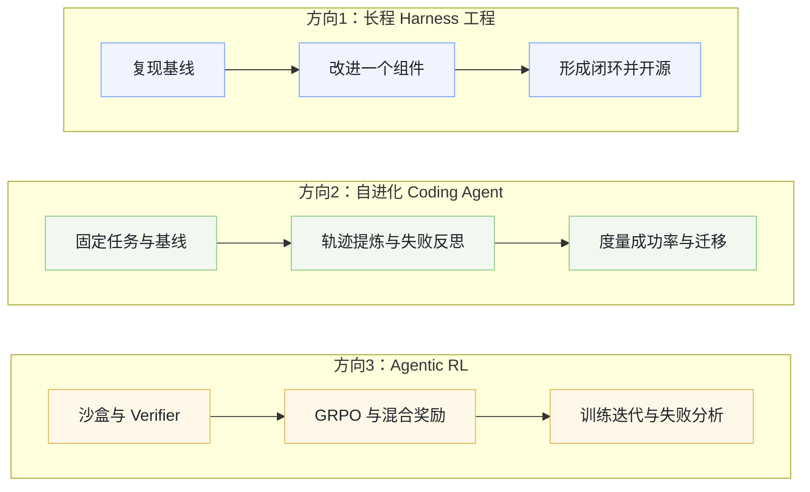

# 从前沿 Lab JD 与战略看 2026 年值得重投入的 AI 研究方向

> [!IMPORTANT]
> 本专题于 2026-08-25 从作者知识库同步，聚焦前沿 Lab 招聘与公开战略信号下的 2026 AI 研究方向判断。趋势判断具有时效性，涉及论文、基准和机构动态时，请继续沿文中线索核对原始来源。

- **深度展开**：[2026 值得重投入的 AI 研究方向：子方向全展开](./01-ai-research-directions-expanded.md)
- **同步版本**：主页面 revision 56，知识库最后编辑时间 2026-08-24

## 专题导航

| 主线 | 核心问题 | 建议入口 |
|:---|:---|:---|
| 长程任务 + Harness | 状态外置、上下文压缩、失败恢复、子 Agent、Skills | [查看完整子方向](./01-ai-research-directions-expanded.md#方向一长程任务--harness-工程) |
| 自进化 / Fully Self-Training | 经验内化、记忆策略、自我评估、闭环可靠性 | [查看完整子方向](./01-ai-research-directions-expanded.md#方向二自进化--fully-self-training) |
| Agentic RL + Verifier | 长程信用分配、可扩展奖励、Reward Hacking | [查看完整子方向](./01-ai-research-directions-expanded.md#方向三agentic-rl--可扩展奖励验证器) |

笔记目标：从通义千问（Qwen）2025–2026招聘JD（25类岗位）、智谱（Zhipu）唐杰内部信（“摸高”/Touch High计划）、字节Seed、月之暗面（Kimi）、DeepSeek、OpenAI、Anthropic等一线Lab的招聘与公开表态出发，系统性梳理“现在该做什么方向”。重点回答三个问题：公司真正押注什么？个人/小团队高ROI方向在哪里？具体怎么投入？

## **一、背景：为什么从JD和战略信入手？**

大模型已进入“能力上界被重新定义”的阶段。单纯刷短任务基准、追架构微创新的边际回报快速下降。真正决定代差的，是能否让模型在真实复杂环境中**稳定完成数小时到数天的任务**、能否**自己积累经验并迭代自身**、以及支撑这一切的**可扩展奖励与安全机制**。

- **智谱“摸高”（Touch High）计划**（2026年7月11日唐杰《巨浪已来》内部信）：明确延续“反直觉”路线，未来两年不追求短期商业变现，直指AGI下一个高地，“不登顶，就是失败”。四大核心引擎：  后续（8月）唐杰公开反思：万亿参数是早期弯路，GLM-5.3在不改参数量的情况下，仅用一个月扩大长程任务环境 + 强化学习，内部Code Bench提升约50%。下一步可能轮到中期训练/预训练。

  1. 长程任务（Long Horizon Task）——从“即时问答”到“宏大工程”，新一代记忆架构，边学边做边记，自主拆解如“设计新型抗癌药物分子”等目标为数千子任务。
  2. 完全自治的智能体系统（Autonomous Agent System）——大量专业智能体协同，从“智能助手”到“数字员工社会”。
  3. 完全自我训练（Fully Self Training）——人类高质量数据见顶后，用算力做进化燃料，AI与AI博弈（Self-Play）、合成数据工厂、安全沙盒内重构自身代码。
  4. 极致安全治理——特别强调，计划投入百亿级资源攻坚机械可解释性，厘清神经元逻辑，从黑盒走向透明。
- **通义千问（Qwen）团队**：2026年校园招聘开放25类岗位，几乎覆盖基座大模型全链路（基模前沿算法、预训练、Infra、后训练、多模态、Agent、AI安全、AI for Science/Engineering等）。岗位文案反复强调“定义下一代模型该长什么样”“不是参与，而是做到最好”。密度最高的是后训练、Agent、奖励与评测、自进化相关方向。
- **字节Seed**：2026年8月完成基础模型组织重构。新设四个一级部门（向吴永辉汇报）：  明确目标是合并相似工作、减少overlap，为传闻中的5万亿参数级超大模型铺路，同时强化Agentic能力。

  - Pretrain Data（统一多模态/超大模型预训练数据）；
  - **Horizon RL**（整合后训练/推理/视觉理解，主攻强化学习以提升智能上限，下设RL Scaling、Reasoning、视觉强化学习）；
  - Product Posttrain-Work（B端/Agentic办公场景，支持豆包、Dola任务模式）；
  - Product Posttrain-Chat（C端对话）。
- **月之暗面（Kimi）**：将2026年范式明确为Harness工程 + 水平扩展。K2.5/K2.6引入Agent Swarm（最多300个子Agent并行协作、4000+工具调用、PARL训练），K3（2.8T MoE、百万上下文）强调长程编码、自主科研。AgentEnv训练期间建立超5100万沙盒。公开表态：长上下文（干活时长）、Token效率、Agent集群三者叠加 = 更强Agent。Harness决定上限的实证已出现（同一模型换Harness可带来显著分差）。
- **DeepSeek**：大规模扩招（所有部门至少翻倍），Agent Harness团队、Agent Infra、Code Agent数据、持续学习/自进化/新范式Frontier研究员占据核心。公开公式：**Model + Harness = Agent**。2026年8月开源DeepSeek Harness v0.1（MIT协议，一切皆插件，包括Agent Loop本身），明确支持Self-Evolving Agent Harness。对标Claude Code类系统，招聘中反复出现“上下文管理、长期记忆、Subagent、自进化”。
- **OpenAI与Anthropic**：公开讨论高频主题是递归自我改进（RSI）、自动化AI研究员、Agent写代码比例已超80%（Anthropic 2026年5月数据：Claude贡献超80%合并代码，工程师日产出代码量约8倍）、多智能体协调风险与机遇。Anthropic《When AI Builds Itself》报告显示，任务完成时间视界约每4个月翻倍；OpenAI推出RSI Index，GPT-5.6 Sol已能独立完成部分后训练任务。但MIT Technology Review等指出，当前Agent在真正开放式创新研究上仍有明显短板（工程能力强、创意不足）。

这些信号高度一致：**向上摸高（冲击智能上界）+ 向下铺路（开源与工程落地）**。与2026年全球前沿完全吻合——大量Long-Horizon Agents与Self-Evolving Agents综述（如《Towards Long-Horizon Agents》149页调研、arXiv 2507.21046及后续可靠自进化综述）、METR时间视界快速翻倍（从秒级到12小时+，近期加速至约4个月一倍）、GLM-5.x / Qwen3.x / Kimi K3 / DeepSeek V4在长程coding与Agent基准上的突破。

## **二、Qwen 25类岗位全景梳理（按方向归类，已验证与官方校招一致）**

**DIRECTION 01 阿里星顶尖人才计划**

1. 基础大模型前沿技术（架构、学习机制、多模态多智能体、数据、推理优化、评测安全）
2. 训练算法-系统协同（万卡稳定性、Fine-Grained MoE、长上下文Attention、Self-Evolving训练闭环）

**DIRECTION 02 模型底座：预训练 · 数据 · Infra**

1. 预训练（MoE优化、线性/稀疏注意力、KV Cache、训练稳定性、Optimizer、Scaling Law、蒸馏）
2. 预训练数据（采集、质量评估、筛选配比、合成、mid-train模型驱动合成、数据scaling）
3. Infra（训练系统优化、高性能推理、MFU提升）

**DIRECTION 03 后训练与强化学习**

1. 后训练（高质量数据合成、RL与偏好对齐、自适应链路、全链路训练、数据飞轮）
2. 合版算法（数据策略、冲突消解、On-policy Distillation、知识融合）
3. 模型自进化（RSI能力、自动迭代SFT/RL数据、自动挖掘训练数据、自动Infra调优）
4. 强化学习（PPO/DPO/GRPO/ORPO等、规则遵循、多目标平衡、Reasoning模型）
5. 强化学习模型训练（大规模RL稳定性与效率、Agentic RL链路、Coding/Long-horizon Agent训练数据与奖励）

**DIRECTION 04 奖励、对齐与评测**

1. Agentic Reward System（支撑大规模Agentic RL的奖励信号、Verifier、专项能力）
2. RLHF算法（偏好采集与建模、Reward Model、Badcase聚类、LLM Judge/Verifier）
3. 大模型评测（弱点挖掘、LLM-as-a-Judge、Reward Signal合成、评测框架）
4. 评估系统算法（弱点诊断、评测数据集、边界测试、评测工程）

**DIRECTION 05 多模态 · 全模态 · 多语言**

1. 多模态基础模型与多模态Agent（视觉/视频编码器、跨模态融合、Token压缩、世界表征、感知-推理-规划-记忆-工具-环境交互）
2. 全模态基础模型（音视频理解、多说话人、美学、Agentic与长程任务、proactive/live交互）
3. 多语言技术（预训练、评价、后训练、多模态对齐）

**DIRECTION 06 Agent 与 Coding**

1. Agent算法研究（Cowork Agent、Computer Use Agent、Envs/Harness、Data Design、Agentic Rewarding）
2. Agentic Coding模型训练（代码重构、长上下文、仓库级理解、长程生成、规划-记忆-自我反思）
3. AI Agent研发（Planning、Reasoning、Tool Use、Memory、RAG、RL/SFT/DPO、Agent框架与Runtime、评测体系）
4. Harness研究工程师（模型与Harness协同进化、VL/Coding/CoWork能力边界、实验平台、反馈闭环）

**DIRECTION 07 AI 安全**

1. 安全大模型（网络安全、数据安全、内容安全垂直基座）
2. AI安全（安全数据集、领域适配、多模态感知检测、Agent推理规划、对抗安全与评测）

**DIRECTION 08 AI for Science/Engineering**

1. AI for Science（科学场景基础模型与核心算法、端到端智能建模）
2. AI for Engineering（工程场景应用、self-evolving/long-horizon/multi-agent增强、Agent系统与评测基准）

## **三、高ROI核心方向（个人/小团队优先）**

综合多家Lab战略、全球研究密度（Long-Horizon与Self-Evolving综述爆发）、可验证性与资源门槛，当前最高ROI的三个方向如下（证据进一步强化）：

**1. 长程任务能力 + Harness工程（最高优先级）**

核心问题：模型单步很强，但真实任务（仓库级coding、多小时研究、跨工具工作流）仍会漂移、早停、无法恢复。瓶颈从“模型权重”转向“模型 + 外部Harness的协同进化”。

为什么高ROI：反馈快、可量化（PassRate、时间视界、过程指标）、开源友好、公司急招。2026年实证：同一backbone换Harness可带来10–18个百分点提升（Jefferies等实测）；METR显示前沿Agent 50%时间视界已达12小时+，倍增周期缩短至约4个月；DeepSeek开源Harness、Kimi Agent Swarm、字节Horizon RL、Qwen Harness岗位均显式重点。

关键子问题：稠密过程奖励、continue-until-timeout策略、经验记忆与技能复用、失败恢复机制、Harness本身的自进化（一切皆插件）。

**2. 自进化 / Fully Self-Training（模型与系统共同进化）**

核心问题：人类高质量数据见顶，速度成为代差。让模型/Agent自己写代码、合成数据、调Infra、积累技能，形成闭环。

为什么高ROI：直接服务“AI训练AI”，论文与开源爆发（Self-Evolving Agents Survey系列、Co-Evolution调研），编码领域最易验证。已有系统实现同一任务token消耗大幅下降、成功率翻倍；Anthropic/OpenAI内部RSI已落地（代码贡献超80%、部分后训练自动化）；DeepSeek明确标注持续学习/自进化为Frontier方向。

关键子问题：技能库自动提炼、记忆固化、脚手架（prompt/工具策略）自修改、离线/在线混合自进化、安全沙盒内的代码自重构、可靠性梯子（评估与更新解耦）。

**3. Agentic RL + 可扩展奖励/验证器系统**

核心问题：大规模Agentic RL的稳定性与效率、长程轨迹的信用分配、可扩展且抗hack的奖励信号。

为什么高ROI：后训练是当前性价比最高的杠杆。GRPO及其变体 + 可执行验证器已成为事实标准。字节新设Horizon RL部门，Kimi强调端到端RL训练Agent（PARL），多家Lab在Code Agent数据与奖励上持续投入；智谱GLM-5.3用纯RL长程环境实现显著提升。

关键子问题：过程奖励设计、混合奖励（规则+模型+Verifier）、异步训练、reward hacking防护、评测与训练信号解耦。

## **四、其他方向的ROI评估（诚实对比）**

| **方向** | **短期ROI** | **资源门槛** | **反馈速度** | **公司匹配** | **建议** |
|-|-|-|-|-|-|
| 长程Harness + 稠密奖励 | 很高 | 低-中 | 快 | 极高 | **主攻** |
| 自进化Coding Agent | 很高 | 低-中 | 快 | 极高 | **主攻** |
| Agentic RL + 可验证奖励 | 很高 | 中 | 中-快 | 极高 | **主攻** |
| 多模态/全模态Agent | 中高 | 中 | 中 | 高 | 有视觉背景再冲，或作为增强模块 |
| Agent安全与可解释性 | 中 | 低-中 | 中 | 高 | 强烈建议嵌入主方向（智谱百亿投入） |
| Agent轨迹合成数据飞轮 | 中 | 中 | 中 | 高 | 服务主方向 |
| 预训练架构/MoE/长上下文 | 低 | 很高 | 慢 | 中 | 除非已有大资源或系统专长（智谱已反思弯路） |
| Infra（训练/推理系统） | 低 | 很高 | 慢 | 中 | 团队内部优化为主 |
| AI for Science/Engineering | 低（短期） | 中-高 | 慢 | 中 | 有强领域背景再考虑，长期影响力高 |
| 纯多语言/纯安全基座 | 中低 | 中 | 中 | 中 | 垂直场景有机会，但通用性弱 |

**结论**：其他方向并非没价值，但对大多数个人/早期研究者，短期ROI明显低于前三个。最聪明的策略是主攻高ROI方向，同时把多模态、安全、数据等作为“增强插件”嵌入。Harness工程正从“可选”变为“必选项”——决定Agent上限的证据已充分。

## **五、三个方向的具体投入路径（可落地版，更新资源）**

**方向1：长程Harness工程 + 稠密奖励评测**

1. 第1–2周：复现基线。装Harbor + Terminus-2 / OpenHands / DeepSeek Harness，跑LHTB、RoadmapBench、AgencyBench、Terminal-Bench或METR相关子集。固定开源模型，记录最终分 + 过程指标（早停率、循环次数、恢复成功率、时间视界）。
2. 第3–6周：改一个组件。加continue-until-timeout、稠密过程奖励（每步检查中间artifact）、轻量记忆（经验图或技能库）、插件化扩展。目标：同一模型上提升5–15个点，并证明可迁移。
3. 第7–12周：闭环+开源。把改进的Harness开源，写清晰ablation技术报告。

关键资源：《Towards Long-Horizon Agents》综述（2026年7月，149页）、Harbor + LHTB、RoadmapBench、AgencyBench、DeepSeek Harness、METR时间视界页面、Jefferies Agent实测对照。

**方向2：自进化Coding Agent（技能/记忆/脚手架进化）**

1. 起步：选简单coding agent（OpenHands / Qwen-Code / DeepSeek Harness等），在固定repo集合上反复跑同一类任务。
2. 加入进化回路：轨迹→技能抽取（成功路径封装成Skill Block）；失败→反思+记忆写入；可选让Agent自改prompt或工具策略（沙盒回滚）。进阶：Harness自修改（插件生成）。
3. 度量：同一任务多轮后的token消耗、成功率、跨任务迁移。进阶接到长程环境做离线+在线混合。

关键资源：Self-Evolving Agents Survey（arXiv 2507.21046及后续可靠自进化/L0–L4 taxonomy综述）、Self-Evolving Coding Agents调研、GenericAgent、MemOS、技能树类项目、DeepSeek Harness插件架构。

**方向3：Agentic RL + 可验证奖励（GRPO系 + 混合奖励）**

1. 环境：Docker沙盒 + 可执行verifier（pytest、自定义检查脚本），优先coding或terminal任务。
2. 算法：从GRPO起步，再试DAPO等变体。
3. 奖励设计：稀疏（最终pass/fail）+ 稠密/混合（过程检查 + LLM-as-Judge + 规则过滤防hacking）。
4. 训练：小模型（7B–32B）+ LoRA，先做几十到几百条轨迹再扩。目标提升resolve rate并分析失败模式。

关键资源：slime、VERL、TRL GRPOTrainer、AgentV-RL、HERO、NVIDIA/Hugging Face Agentic RL教程、字节DAPO相关开源。实践建议：SFT冷启动 → GRPO → 失败案例挖掘 → 再迭代。

**总体投入建议**

- 时间分配：60%方向1（最快出可见成果），30%方向2或3（根据现有经验选），10%读综述跟进。
- 最小可行实验：选一个硬基准 + 开源模型 + 可改Harness，两周跑通基线，四周做出可量化提升。
- 产出导向：开源repo、清晰ablation技术报告、过程分析。这些直接对应一线Lab当前最急缺的能力（DeepSeek/Harness岗位、Qwen Harness工程师、字节Horizon RL等）。
- 避坑：不要一开始就追百万卡预训练或纯架构创新；先把“模型+Harness+奖励闭环”跑通，再往自进化/更大规模推。安全与可解释性建议作为主方向的“插件”而非独立主线。

## **六、结语与个人选择建议**

2026–2028是“从能回答到能可靠执行、从人工迭代到自我进化”的窗口期。智谱摸高四大引擎、Qwen 25类岗位密度、字节Horizon RL与Agentic拆分、Kimi Harness + Swarm、DeepSeek Model+Harness公式、OpenAI/Anthropic RSI实证，已经把地图画得很清楚：**长程自治 + 自进化闭环 + 可扩展奖励与安全**，就是当前最高杠杆的方向。

个人投入原则：

- 优先选反馈快、可验证、资源门槛可控的问题。
- 把安全、数据、多模态作为增强，而不是一开始就分散。
- 产出导向：开源 + 可复现实验 + 过程分析，比单纯刷分更有长期价值。
- 关注METR时间视界与Harness实证——它们是当前最硬的进度条。
