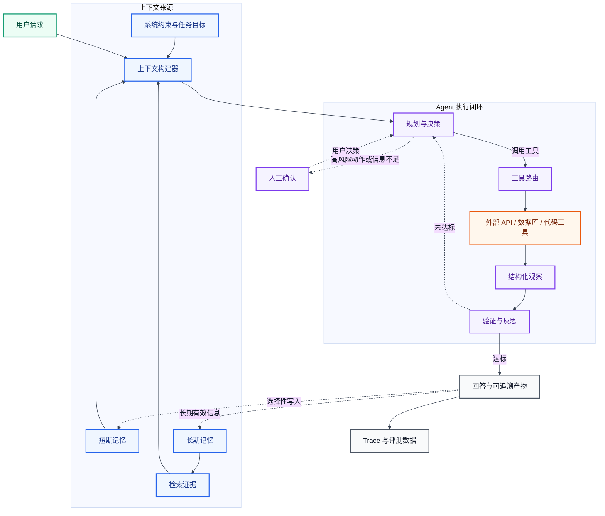

# Context Engineering System

上下文工程系统的数据流、Agent 执行闭环与人工确认边界。

```mermaid
%%{init: {"theme": "base", "themeVariables": {"background": "#ffffff", "fontFamily": "Arial, sans-serif", "lineColor": "#374151", "primaryTextColor": "#111827"}}}%%
flowchart TB
    U[用户请求]

    subgraph Context[上下文来源]
        direction LR
        P[系统约束与任务目标]
        S[短期记忆]
        R[检索证据]
        L[长期记忆]
        CB[上下文构建器]
        L --> R
        P --> CB
        S --> CB
        R --> CB
    end

    U --> CB

    subgraph Loop[Agent 执行闭环]
        direction LR
        A[规划与决策]
        T[工具路由]
        X[外部 API / 数据库 / 代码工具]
        O[结构化观察]
        V[验证与反思]
        A -->|调用工具| T
        T --> X
        X --> O
        O --> V
        V -. 未达标 .-> A
    end

    CB --> A
    A -. 高风险动作或信息不足 .-> H[人工确认]
    H -. 用户决策 .-> A
    V -->|达标| OUT[回答与可追溯产物]
    OUT --> TRACE[Trace 与评测数据]
    OUT -. 选择性写入 .-> S
    OUT -. 长期有效信息 .-> L

    classDef input fill:#ECFDF5,stroke:#059669,color:#064E3B,stroke-width:2px;
    classDef context fill:#EFF6FF,stroke:#2563EB,color:#1E3A8A,stroke-width:2px;
    classDef agent fill:#F5F3FF,stroke:#7C3AED,color:#4C1D95,stroke-width:2px;
    classDef external fill:#FFF7ED,stroke:#EA580C,color:#7C2D12,stroke-width:2px;
    classDef output fill:#F9FAFB,stroke:#4B5563,color:#111827,stroke-width:2px;

    class U input;
    class P,S,R,L,CB context;
    class A,T,O,V,H agent;
    class X external;
    class OUT,TRACE output;
```
